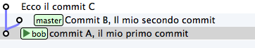
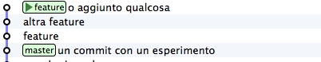
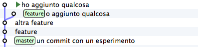
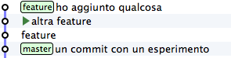
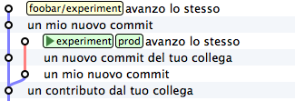
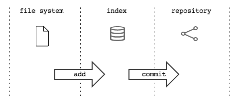

.. _dailygit:
#########
Daily git
#########

Questa guida si chiude con una breve serie di piccoli suggerimenti
pratici che ti risulteranno molto utili nel tuo uso quotidiano di git

Ottenere una copia di un ``repository``
#######################################

Fin'ora hai visto come creare un ``repository`` da zero e come fare a
popolarne uno vuoto a colpi di ``push``. Spesso (anzi, spessissimo) ti
capiterà di dover partire da una copia di un ``repository`` esistente.

Allo scopo, puoi usare il comando ``git clone`` col quale otterrai in
locale una copia completa della storia dei ``commit`` di un
``repository``. Dopo aver clonato un ``repository`` remoto, questo verrà
aggiunto in automatico come ``remote`` sotto il nome di default
``origin``.

Per esempio, per ottenere un ``clone`` di questa guida esegui

.. code-block:: bash

    git clone https://github.com/arialdomartini/get-git.git
    cd get-git
    git remote
    origin

Eliminare un file
#################

Rammenti che per aggiungere un file nell'\ ``index`` hai usato il
comando ``git add``? Ecco: quando cancelli dal ``file system`` un file
già tracciato da git, perché includere la cancellazione nel ``commit``
devi cancellare il file anche dall'\ ``index`` con

.. code-block:: bash

    git rm file\_name

Potresti trovare molto comoda l'opzione ``-a`` di ``commit``

.. code-block:: bash

    git -am "include add e rm"

che implicitamente fa ``add`` dei file modificati e ``rm`` di quelli
rimossi prima di eseguire il ``commit``.

Il ``detached head state``
##########################

Considera questo ``repository``

È evidente che l'ultimo comando di ``checkout`` sia stato
``git checkout bob``: si è *aggrappati* all'etichetta ``bob``.

Usando una terminologia un po' più corretta, potresti dire "*``HEAD`` in
questo momento punta a ``bob``*\ ".

Questa di ``HEAD`` non è una metafora: c'è davvero una variabile
``HEAD`` il cui contenuto è un puntatore al ``branch`` ``bob``. Questa
variabile (come, del resto, tutti i i ``branch`` locali e remoti) è
conservata nella directory nascosta ``.git``

.. code-block:: bash

    cat .git/HEAD
    ref: refs/heads/bob

La variabile ``HEAD``, tra le varie cose, permette a git di aggiornare
il ``branch`` nel quale ti trovi, in modo che *ti segua*
``, quando esegui un commit``.

Quindi: ``HEAD`` punta a ``bob``. A sua volta ``bob`` punta al
``commit`` ``A``. Per verificarlo, esegui

.. code-block:: bash

    cat .git/refs/heads/bob
    dd15c2bee7059de07c4d74cf5f264b906d332e30

Prova a *staccarti* dal ``branch`` ``bob``, restando sempre sul medesimo
``commit``; cioè, fai un ``checkout`` usando direttaente la chiave del
``commit`` ``A``

.. code-block:: bash

    git checkout dd15c2bee7059de07c4d74cf5f264b906d332e30

    Note: checking out 'dbf9b91bac0bc93ab2979ca6a65bf2ac3dbc16ff'.

    You are in 'detached HEAD' state. You can look around, make experimental
    changes and commit them, and you can discard any commits you make in this
    state without impacting any branches by performing another checkout.
    
    If you want to create a new branch to retain commits you create, you may
    do so (now or later) by using -b with the checkout command again. Example:
    
    git checkout -b new_branch_name
    
    HEAD is now at dbf9b91... ** inside a code block doesn't work: removed

git si lamenta un po'. O meglio: ti avvisa che non sei *attaccato* ad un
``branch`` per cui qualsiasi modifica farai non avrà impatto sulla
posizione di alcun ``branch``. Ti suggerisce anche di crearne uno col
comando ``git checkout -b``.

Se ripeti

.. code-block:: bash

    cat .git/HEAD
    dd15c2bee7059de07c4d74cf5f264b906d332e30

scopri che, effetticamente, ``HEAD`` sta puntando direttamente al
``commit`` e non ad un ``branch``

Lo stato in cui ``HEAD`` non punta ad un ``branch`` viene chiamato
``detached head``.

Ora, non c'è niente di particolarmente sbagliato nello staccarsi da un
``branch`` e mettersi in ``detached head state``: capita di avere
bisogno. Ma spesso procura qualche grattacapo, soprattutto se non ci si
accorge di esservi entrati. Per questo git mette in guardia.

Dovesse capitarti di leggere quell'avviso chilometrico, non spaventarti:
tutto quel che probabilmente dovrai fare è domandarti se forse non
volessi piuttosto entrare in un ``branch``.

Sovrascrivere l'ultimo ``commit``
#################################

Prendi il ``repository``

.. figure:: img/bug-5.png

e aggiungici un ``commit``

.. code-block:: bash

    echo qualcosa >> feature
    git commit -am "o aggiunto qualcosa"

Ma no, che figure! Hai scritto "ho" senza l'acca!

Puoi rimediare *sovrascrivendo* il tuo ultimo ``commit`` con l'ozione
``--amend`` di ``commit``

.. code-block:: bash

    git commit -am "ho aggiunto qualcosa" --amend

.. figure:: img/amend-2.png

Ora: non c'è niente di magico in quel che hai appena visto: git, come al
solito, non ha *riscritto* la storia. Prova a visualizzare tutti i
``commit`` del ``repository``, compresi quelli dei ``branch`` orfani
(SmartGit li chiama "*lost heads*\ ")

.. figure:: img/amend-3.png

Vedi? Il ``commit`` con il commento sbagliato c'è ancora.

Proviamo ad immaginare cosa potrebbe aver fatto dietro le quinte git
quando hai usato l'opzione ``--amend``: è tornato al ``commit``, ha
recuperato le stesse modifiche che avevi apportato e poi ha ripetuto il
``commit`` cambiando il commento.

Prova a simularlo passo passo: partivi da

Torna indietro di un ``commit``

.. code-block:: bash

    git checkout feature^1

.. figure:: img/amend-4.png

Recuperano le modifiche apportate in ``feature``, senza committarle

.. code-block:: bash

    git cherry-pick feature --no-commit

e poi committale con il messaggio corretto

    git commit -am "ho aggiunto qualcosa"

Non ti resta che spostare sul ``commit`` corrente il branch ``feature``

.. code-block:: bash

    git branch -f feature HEAD

.. figure:: img/amend-6.png

E infine, fai il ``checkout`` del ``branch``

.. code-block:: bash

    git checkout feature

.. figure:: img/amend-7.png

Come vedi, l'opzione ``--amend`` è un altro di quegli esempi di *macro*
comandi che si poggiano su operazioni più granulari che potresti anche
eseguire passo passo manualmente ma che sono così comuni che è molto più
comodo associare ad un comando dedicato.

Puoi usare ``--amend`` non solo per modificare il commento: puoi
sovrascrivere il tuo ultimo commit aggiungendo file che ti eri
dimenticato, correggendo delle modifiche e così via. Di fatto, stai
facendo un nuovo ``commit``, per cui non ci sono vincoli al tipo di
correzioni che puoi apportare.

Eliminare l'ultimo ``commit``
#############################

Parti dalla fotografia del ``repository`` che hai ottenuto dal
precedente paragrafo

.. figure:: img/amend-7.png

Immagina che tu abbia valutato che, dopo tutto, il tuo ultimo ``commit``
non vada bene: vorresti eliminarlo.

Una cosa che potresti fare è spostare il ``branch`` ``feature`` al
``commit`` precedente per ottenere

.. figure:: img/reset-4.png

Vediamo passo passo come fare

Parti da

.. figure:: img/amend-7.png

Ti sposti sul precedente ``commit``

.. code-block:: bash

    git checkout HEAD^1

che significa "*vai sul ``commit`` padre di ``HEAD``*\ ", cioè sul
``commit`` precedente a quello dove ti trovi adesso

Adesso puoi spostare ``feature`` nel punto ti trovi: per farlo, puoi
creare un branch ``feature`` nel punto dove ti trovi, sovrascrivendo la
posizione attuale di ``feature`` con l'opzione ``-f`` di ``branch``

.. code-block:: bash

    git branch -f feature HEAD

.. figure:: img/reset-2.png

Nascondendo i ``commit`` orfani il risultato diventa evidente

.. figure:: img/reset-4.png

Sarai senz'altro d'accordo come me che sia una procedura troppo
macchinosa per un'esigenza così comune.

Come al solito, git ha un comando che, dietro le quinte, esegue tutti
questi passi: ``git reset``. A dire la verità, ``reset`` è ben più
versatile e potente.

``git reset`` sposta ``HEAD`` nel punto specificato come argomento.
Ricordi che ``HEAD`` è sempre il tuo ``branch`` corrente, vero? Quindi,
in altre parole, ``reset`` permette di *spostare* il tuo ``branch``
corrente in un qualsiasi altro punto del ``repository``.

Per esempio partendo da

.. figure:: img/amend-7.png

puoi *resettare* il tuo ``branch`` corrente al ``commit`` precedente
puoi fare

.. code-block:: bash

    git reset HEAD^1

.. figure:: img/reset-4.png

Non sei limitato a spostare il ``branch`` corrente sul ``commit``
precedente: puoi *resettarlo* in qualunque posizione. Per esempio, per
portare ``feature`` su master puoi fare

.. code-block:: bash

    git reset master

.. figure:: img/reset-5.png

Puoi anche spostare il ramo corrente da una linea di sviluppo all'altra

Partendo da

.. figure:: img/reset-6.png

con

.. code-block:: bash

    git reset prod

ottieni

Tieni conto di una cosa molto importante: ``reset`` non coinvolge solo
uno spostamento di ``branch`` sul ``repository`` ma anche delle
modifiche sul ``file system``. Il ``branch`` che stai spostando,
infatti, è quello corrente, cioè quello di cui hai fatto il
``checkout``; in altre parole, quando esegui un ``reset`` stai
contestualmente facendo il ``checkout`` di un altro ``commit``.

