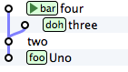

############
Introduzione
############

Questa guida è un po' diversa dalle altre.

Molti dei testi che ho letto su git si preoccupano di introdurti ai
comandi base e lasciano ai capitoli più avanzati la descrizione del
modello di funzionamento interno, oppure la saltano del tutto.

Quello che ho notato, però, è che imparando git partendo dai comandi
base rischi di finire per usarlo come uno strumento vagamente simile a
SVN ma provvisto di un set aggiuntivo di comandi esoterici, il cui
funzionamento ti resterà sostanzialmente oscuro.

Facci caso: alcuni di quelli che hanno imparato git abbastanza da
riuscire ad usarlo quotidianamente ti racconteranno di aver fatto molta
fatica a capire cosa sia un ``rebase`` o di non cogliere esattamente che
uso fare dell'\ ``index``.

La mia impressione è che, una volta capito il modello interno (che è
sorprendentemente semplice!), tutto git appaia improvvisamente lineare e
coerente: non c'è davvero alcun motivo per cui il ``rebase`` dovrebbe
essere un argomento misterioso.

Questa guida prova a spiegarti git seguendo un percorso contrario a
quello adottato di solito: partirai dalla spiegazione degli internal e
finirai per imparare, nello stesso momento, sia comandi base che quelli
avanzati, in poco tempo e senza troppi grattacapi.

Non imparerai, però, tutti i comandi. Piuttosto che mostrarti tutte le
opzioni disponibili, questa guida punterà a farti comprendere i concetti
e il modello sottostante e a darti gli strumenti per essere autonomo
quando vorrai approfondire un argomento sulle *man page* o vorrai fare
qualcosa di fuori dall'ordinario con il tuo ``repository``.

Un'ultima nota: questa guida è organizzata come un lungo tutorial. Se ti
armi di terminale ed esegui ognuno dei comandi, tipograficamente
riportati così

.. code-block:: bash

    ls

potrai riprodurre esattamente sul tuo computer ognuno degli esempi della
guida.

Non sono parente di SVN
#######################

Per chi arriva da SVN, git presenta una sola difficoltà: ha molti
comandi identici. Ma è una somiglianza superficiale e ingannevole: sotto
il cofano git è totalmente differente.

Per questo ti suggerisco di rifuggire sempre dalla tentazione di fare
dei paralleli con SVN, perché sarebbero solo fuorvianti. Troverai
comandi come ``add``, ``checkout``, ``commit`` e ``branch`` che ti
sembrerà di conoscere. Ecco: fai *tabula rasa* di quel che conosci,
perché in git quei comandi significano cose molto molto differenti.

Tentare di capire git usando SVN come modello, a volte, porta
semplicemente fuori strada. Per esempio: ci crederesti che questo
repository ha 3 branch?

   
Sì: 3 branch, non 2.

Oppure: ci crederesti che git, più che un sistema di versionamento del
codice, potrebbe essere meglio descritto come un "*sistema peer-to-peer
di database chiave/valore su file system*\ "?

Dopo aver letto la guida torna a leggere queste due affermazioni:
sono pronto a scommettere che le troverai ovvie.

Ecco il mio consiglio: dimentica quello che sai sui branch e sui 
changeset di SVN e preparati a concetti completamente nuovi.
Sono persuaso che li troverai molto più omogenei e potenti di quelli di
SVN. 

Devi solo predisporti ad un piccolo salto culturale.

Setup
#####

Installa `git <http://git-scm.com/downloads>`__.

Poi configuralo perché ti riconosca

.. code-block:: bash

    git config --global user.name "Arialdo Martini"
    git config --global user.emal arialdomartini@gmail.com

Se sei su Windows puoi eseguire quei comandi in ``git bash``, un
terminale predisposto a ``git``. Su Linux e Mac OS X, dopo 
l'installazione, troverai il tuo terminal preferito già pronto
all'uso.

Se vuoi, installa anche un client grafico. Io ti suggerisco
`SmartGit <http://www.syntevo.com/smartgithg/>`__, che è gratuito per
progetti OpenSource. Altrimenti appoggiati al tool ``gitk`` che trovi in
bundle insieme all'installazione di git.

Fantastico. Partiamo.

:ref:`Indice <indice>` ::  :ref:`Gli internal di git <internal>`
