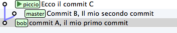
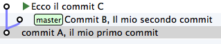
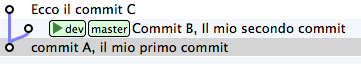
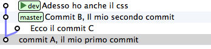

.. _obiettivo_3:

Obiettivo 3: creare un branch
#############################

Con il comando ``checkout`` hai imparato a spostarti da un ``commit``
all'altro

Tutto quello di cui hai bisogno è la chiave del ``commit`` sul quale
vuoi atterrare >\ **git log --oneline --all**\  >deaddd3 Ecco il commit
C >2a17c43 Commit B, Il mio secondo commit >56674fb commit A, il mio
primo commit

.. figure:: img/repo1.png

.. code-block:: bash

    git checkout 56674fb   # vai al ``commit A``
    git checkout 2a17c43   # vai al ``commit B``
    git checkout deaddd3   # vai al ``commit C``

Però, bisogna ammetterlo: gestire i ``commit`` ``A``, ``B`` e ``C``
dovendoli chiamare ``56674fb``, ``2a17c43`` e ``deaddd3`` è di una
scomodità unica.

git risolve il problema facendo quel che farebbe ogni programmatore di
buon senso: dal momento che quei numeri sono dei puntatori ad oggetti,
git permette di usare delle variabili per conservarne il valore.
Assegnare un valore ad una variabile è semplice:

.. code-block:: bash

    git branch bob 56674fb

.. figure:: img/bob.png

Vedi l'etichetta ``bob`` proprio in corrispondenza del ``commit A``? Sta
ad indicare che l'etichetta ``bob`` punta a quel ``commit``.

Quando crei un'etichetta, se non specifichi un valore, git userà la
chiave del ``commit`` sul quale ti trovi al momento

.. code-block:: bash

    git checkout 300c737
    git branch piccio

L'eliminazine di una variabile è ugualmente banale:

.. code-block:: bash

    git branch -d bob
    git branch -d piccio

Avrai notato che di default git crea alcune di queste variabili. Per
esempio, nelle figure sopra appariva anche la variabile ``master``,
puntata su ``B``.

L'etichetta ``master`` ti permette di andare sul quel ``commit``
scrivendo:

.. code-block:: bash

    git checkout master

Ora attento, perché siamo di nuovo in una di quelle occasioni dove la
conoscenza di SVN fornisce solo dei grattacapi: queste etichette in git
si chiamano ``branch``. Ripetiti mille volte: un ``branch`` in git non è
un ramo, è un'etichetta, un puntatore ad un ``commit``, una variabile
che contiene la chiave di un ``commit``. Tanti comportamenti di git che
appaiono assurdi e complicati diventano molto semplici se eviti di
pensare ai ``branch`` di git come ad un equivalente dei branch di SVN.

Dovrebbe iniziare a risultarti chiaro perché molti dicano che "*i branch
su git sono molto economici*\ ": per forza! Sono delle semplicissime
variabili!

Crea un nuovo ``branch`` che useremo nelle prossime pagine

.. code-block:: bash

    git branch dev

.. figure:: img/branch-dev.png

Nota un'altra cosa: vedi che accanto a ``master`` SmartGit aggiunge un
segnaposto triangolare verde? Quel simbolo indica che in questo momento
sei *agganciato* al ``branch`` ``master``, perché il tuo ultimo comando
di spostamento è stato ``git checkout master``.

Potresti spostarti su ``dev`` con

.. code-block:: bash

    git checkout dev

Visto? Il segnaposto si è spostato su ``dev``.

Quel segnaposto si chiama ``HEAD``. Di default, infatti, git aggiunge
sempre anche un ``branch`` implicito, il puntatore ``HEAD``, che punta
sempre all'elemento del ``repository`` sul quale ti trovi. ``HEAD`` ti
segue, qualsiasi movimento tu faccia. Altri editor grafici utilizzano
differenti rappresentazioni per comunicare dove si trovi ``HEAD``.
``gitk``, per esempio, visualizza in grassetto il ``branch`` sul quale
ti trovi. Invece, dalla linea di comando, per sapere su quale ``branch``
ti trovi ti basta eseguire

.. code-block:: bash

    git branch  
    \* dev
    master

L'asterisco suggerisce che ``HEAD`` adesso stia puntanto a ``dev``.

Non dovresti essere troppo sorpreso nel verificare che, nonostante tu
abbia cambiato ``branch`` da ``master`` a ``dev`` il tuo ``file system``
non sia cambiato di una virgola: in effetti, sia ``dev`` che ``master``
stanno puntando allo stesso identico ``commit``.

Non di meno, ti domanderai probabilmente a cosa mai possa servire
passare da un ``branch`` all'altro, se non sortisce alcun effetto sul
progetto.

Il fatto è che quando esegui il ``checkout`` di un ``branch``, in
qualche modo ti *agganci* al ``branch``; l'etichetta del ``branch``, in
altre parole, inizierà a seguirti, ``commit`` dopo ``commit``.

Guarda: adesso sei su ``dev``. Apporta una modifica qualsiasi e committa

    touch style.css git add style.css git commit -m "Adesso ho anche il
    css"

Visto cosa è successo? L'etichetta ``dev`` si è spostata in avanti e si
è agganciata al tuo nuovo ``commit``.

Ti domanderai anche perché mai git chiami quelle etichette ``branch``.
Il motivo è che, anche se le linee di sviluppo che divergono in git non
sono ``branch``, i ``branch`` vengono normalmente usati proprio per dar
loro un nome.

Guardalo nel concreto. Torna a ``master`` ed apporta qualche modifica.

.. code-block:: bash

    git checkout master
    touch angular.js
    git add angular.js
    git commit -m "angular.js rocks"

.. figure:: img/angular.png

Come c'era da aspettarselo, l'etichetta ``master`` è avanzata di un
posto, per puntare al tuo nuovo ``commit``.

Adesso c'è una certa equivalenza tra le linee di sviluppo e i
``branch``. Nonostante questo, ti conviene sempre tenere mentalmente
separati i due concetti, perché ti faciliterà molto la gestione della
storia del tuo progetto

Per esempio: non c'è dubbio che il ``commit`` col commento "*angular.js
rocks*\ " sia contenuto nel ``branch master``, giusto? Che dire però di
``A`` e di ``B``? A quale ``branch`` appartengono?

Occhio, perché questo è un altro dei concetti che procurano dei mal di
testa agli utenti di SVN, e perfino a quelli di Mercurial.

In effetti, per rispondere a questo interrogativo gli utenti di git si
pongono una domanda differente:

"*il ``commit A`` è raggiungibile da ``master``?*\ "

Cioè: percorrendo a ritroso la storia dei ``commit`` partendo da
``master``, si passa da ``A``? Se la risposta è *sì* si può afferamere
che ``master`` contenga le modifiche introdotte da ``A``.

Una cosa che i fan di Mercurial e di SVN potrebbero trovare
disorientante è che, siccome il ``commit A`` è raggiungibile anche da
``dev``, appartiene *sia* a ``master`` che a ``dev``.

Pensaci su. Se tratti i ``branch`` come puntatori a ``commit`` dovrebbe
sembrarti tutto molto lineare.

:ref:`Indice <indice>` :: :ref:`Obiettivo 4: fare i giocolieri con i commit <obiettivo_4>`
