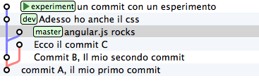
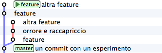

.. _obiettivo_4:

Obiettivo 4: fare i giocolieri con i ``commit``
###############################################

Come hai visto, git riesce a conservare la storia delle modifiche dei
file senza mai salvarne le differenze. All'inizio della guida ti avevo
anticipato come SVN e git manifestassero un comportamento
diametralmente opposto su questo punto

-  SVN memorizza i delta e, all'occorrenza, ricostruisce lo stato
   attuale;
-  git memorizza lo stato attuale e, all'occorrenza, calcola i delta.

Per cui, quando guardi il ``repository``

.. figure:: img/angular.png

e fai riferimento al ``commit`` ``dev``, intendi "*l'intero progetto,
così come è stato fotografato al momento di quel commit*\ ".

Se la stessa situazione fosse su SVN diresti che il commit ``dev``
"*contiene tutte le modifiche apportate ai file, partendo dal commit
immediatamente precedente*\ ".

Per git, calcolare le modifiche apportate ai file da un ``commit``
all'altro non è poi difficile. Per esempio, puoi ricavarle con

.. code-block:: bash

    git diff dev master

Con ``git diff from to`` chiedi a git "*qual è l'elenco delle modifiche
ai file che devo applicare a ``from`` perché il progetto diventi
identico a quello fotografato in ``to``*\ "?

Con un po' di immaginazione puoi pensare che le linee tra i ``commit``
rappresentino le modifiche che tu hai apportato ai file e alle directory
per ottenere un ``commit``. Per esempio, qui in rosso ho evidenziato la
linea che rappresenta quel che hai fatto quando sei partito da ``B`` e
hai creato il commit puntato da ``dev``.

.. figure:: img/angular-highlighted.png

Se rammenti, avevi fatto

.. code-block:: bash

    touch style.css
    git add style.css
    git commit -m "Adesso ho anche il css"

Quindi, potresti dire che quella linea rossa rappresenti l'aggiunta del
file ``style.css``.

Bene. Tieni a mente questo modello. Adesso ti mostrerò uno dei comandi
più folli e versatili di git: ``cherry-pick``.

Il coltellino svizzero: ``cherry-pick``
=======================================

``cherry-pick`` applica i cambiamenti introdotti da un ``commit`` in un
altro punto del ``repository``.

Vediamolo subito con un esempio. A partire da ``dev`` crea un ``branch``
chiamato ``experiment`` ed aggiungici un ``commit``

.. code-block:: bash

    git checkout dev
    git branch experiment
    git checkout experiment
    touch experiment
    git add experiment
    git commit -m "un commit con un esperimento"

Bene: adesso prendi in considerazione la modifica che hai appena
apportato a partire dall'ultimo ``commit`` di ``dev`` e supponi che ti
interessi applicare la stessa modifica anche al ramo ``master``. Con il
comando ``cherry-pick`` puoi chiedere a git di calcolare le modifiche
introdotte dal tuo ``commit`` e riapplicarle da qualche altra parte, per
esempio, proprio su ``master``

.. code-block:: bash

    git checkout master
    git cherry-pick experiment

.. figure:: img/cherry-pick-2.png

``cherry-pick`` "coglie" il ``commit`` che gli indichi e lo applica sul
``commit`` dove ti trovi.

Inizi a intuire le giocolerie che potrai fare con questo strumento?
Voglio darti qualche spunto.

Correggere un bug a metà di un ramo
-----------------------------------

A partire da ``master`` crea un ramo ``feature`` e aggiungici 3
``commit``

.. code-block:: bash

    git checkout -b feature    # scorciatoia per fare branch + checkout
    
    touch feature && git add feature 
    git commit -m "feature"
    
    touch orribile-baco && git add orribile-baco
    git commit -m "orrore e raccapriccio"
    
    touch altra-feature && git add altra-feature
    git commit -m "altra feature"

    
.. figure:: img/bug-1.png

Oh, no! Il secondo ``commit``, quello con il commento "*orrore e
raccapriccio*\ " è stato un errore madornale! Ah, se solo si potesse
riscrivere la storia e rimuoverlo!

Puoi farlo! L'idea è di riportare ``feature`` indietro nel tempo, su
``master``, e di usare ``cherry-pick`` per riapplicarvi una per una le
modifiche, avendo cura però di non applicare le modifiche introdotte da
"*orrore e raccapriccio*\ ". Hai solo bisogno di conoscere i valori
delle chiavi dei 3 ``commit``

.. code-block:: bash

    git log master..feature --oneline
    8f41bb8 altra feature
    ec0e615 orrore e raccapriccio 
    b5041f3 feature

(``master..feature`` è una sintassi che permette di esprimere un *range*
di ``commit``: ne parleremo più avanti)

È il momento di tornare indietro nel tempo. Riposizionati su ``master``

.. code-block:: bash

    git checkout master

e spostaci sopra ``feature``, in modo che torni alla posizione dove si
trovava quando lo hai creato prima di fare i ``commit``

.. code-block:: bash

    git branch --force feature
    git checkout feature

.. figure:: img/bug-2.png

Perfetto. Non hai ricreato esattamente il ``repository`` del passato,
perché i tuoi 3 nuovi ``commit`` ci sono ancora, ma i ``branch`` sono
stati riposizionati dov'erano prima. Non ti resta che prenderti, con
``cherry-pick`` i soli ``commit`` che ti interessano. Prendi il primo,
quello col commento ``feature``

.. code-block:: bash

    git cherry-pick b5041f3

.. figure:: img/bug-3.png

Vedi? Il ``commit`` è stato aggiunto a ``feature``, che poi è avanzato in avanti.
Prosegui con il secondo ``commit``, saltando il ``commit`` incriminato

.. code-block:: bash

    git cherry-pick 8f41bb8

Et voilà. Hai ricostruito il ramo di sviluppo saltando il ``commit``
sbagliato. Resta un ramo orfano, cioè, senza alcun ``branch``: verrà
cancellato prima o poi dal garbage collector di git. Oltretutto, i rami
orfani di solito non vengono mostrati dagli editor grafici, per cui, a
cose normali, dovresti vedere questa come situazione di partenza

.. figure:: img/bug-1.png

e questa come situazione finale

.. figure:: img/bug-5.png

Urca! L'impressione è che git abbia riscritto la storia eliminando un
``commit`` a metà di un ramo, vero?

Infatti, molti raccontano che git sia capace di riscrivere la storia e
che questo suo comportamento sia estremamente pericoloso. Ecco: dovrebbe
risultarti un po' più chiaro che non sia esattamente così; git è
estremamente conservativo e quando ti permette di manipolare i
``commit`` non fa altro che agire in *append*, costruendo *nuovi* rami,
senza mai cancellare quel che già esiste.

Nota anche un'altra cosa: nel momento in cui hai ricostruito il ramo
prendendo con ``cherry-pick`` un ``commit`` alla volta, niente ti
obbligava a riapplicare i ``commit`` nello stesso ordine originario:
volendo, avresti potuto applicarli al contrario, ottenendo, di fatto, un
ramo con i ``commit`` invertiti. Non è una cosa che capita spesso di
fare: ma adesso sai che si può fare.

Spostare un ramo di sviluppo
----------------------------

Voglio farti vedere un'altra magia del ``cherry-pick``, per introdurti
al comando ``rebase``.

Riprendi il tuo ``repository``.

.. figure:: img/rebase-1.png

Mettiamo che tu voglia proseguire lo sviluppo dei tuoi css, per cui
farai un nuovo commit su ``dev``

.. code-block:: bash

    git checkout dev
    echo "a { color:red; }" >> style.css
    git commit -am "i link sono rossi"

Nota: ho usato l'opzione ``-a`` di ``commit`` che, implicitamente,
esegue ``git add`` di ogni file modificato. Tieni a mente questa
opzione: è molto comoda e ti capiterà spessissimo di usarla.

Ottimo. I tuoi css sono pronti per andare in produzione. Peccato solo
che il ramo ``dev`` sia rimasto un po' indietro rispetto a ``master``,
che tu potresti decidere di considerare il codice *production-ready*.
Del resto, cosa potevi farci? Mentre tu ti occupavi dei css, ``master``
è andato avanti e ``dev``, ovviamente, è rimasto lì dove lo avevi
creato.

Certo, se si potesse staccare il ramo ``dev`` per poi spostarlo *sopra*
``master``...

Non ti torna in mente ``cherry-pick``? È un caso come quello precedente:
solo che invece di viaggiare nel passato devi avere un po' di fantasia e
immaginare di viaggiare nel futuro. Si tratterebbe di prendere uno ad
uno i 2 ``commit`` di ``dev`` e riapplicarli sull'ultimo commit di
``master`` (che, relativamente a ``dev``, è il futuro).

Cioè: a colpi di ``cherry-pick`` potresti riscrivere la storia come se i
commit di ``dev`` fossero stati scritti *dopo* i ``commit`` di
``master``.

Se lo facessi, il risultato sarebbe questo

.. figure:: img/rebase-3.png

Confrontalo con la situazione di partenza

Potresti interpretarla così: il ramo ``dev`` è stato staccato ed è stato
impiantato sopra ``master``.

Ecco: ``rebase`` non è altro che una *macro* che esegue automaticamente
una serie di ``cherry-pick`` per evitarti di spostare a mano un
``commit`` alla volta da un ramo all'altro.

Prova. Sul tuo ``repository``

esegui

.. code-block:: bash

    git rebase master

.. figure:: img/rebase-3.png

Voilà!

Hai chiesto a git: "*sposta il ramo corrente sulla nuova base
``master``*\ ".

Ricorda: ``rebase`` è del tutto equivalente a spostare uno per uno i
``commit`` con ``cherry-pick``. Solo, è più comodo.

Riesci ad immaginare dove potrebbe tornarti utile ``rebase``? Guarda,
provo a descriverti una situazione molto comune.

Inizia staccando un nuovo ramo da ``dev`` e registrando 3 nuovi
``commit``

.. code-block:: bash

    git checkout -b sviluppo
    touch file1 && git add file1 && git commit -m "avanzamento 1"
    touch file2 && git add file2 && git commit -m "avanzamento 2"
    touch file3 && git add file3 && git commit -m "avanzamento 3"

.. figure:: img/rebase-4.png

Bene. Adesso simuliamo una cosa che accade molto spesso nel mondo reale:
i tuoi colleghi, mentre tu lavoravi sui tuoi 3 ``commit`` hanno fatto
avanzare il ramo ``dev`` con i loro contributi

.. code-block:: bash

    git checkout dev
    touch dev1 && git add dev1 && git commit -m "developer 1"
    touch dev2 && git add dev2 && git commit -m "developer 2"

.. figure:: img/rebase-5.png

Questa situazione è sostanzialmente inevitabile, a causa della natura
fortemente non lineare del processo di sviluppo: è figlia diretta del
fatto che le persone lavorino in parallelo. ``rebase`` ti permette di
rendere la storia del ``repository`` nuovamente lineare. Come
nell'esempio precedente, il tuo ramo ``sviluppo`` è rimasto indietro
rispetto alle evoluzioni di ``dev``: usa ``rebase`` per staccarlo dalla
sua base e riattaccarlo più avanti

.. code-block:: bash

    git checkout sviluppo
    git rebase dev

Con ``git rebase dev`` stai chiedendo a git "*riapplica tutto il lavoro
che ho fatto nel mio ramo come se lo avessi staccato dall'ultimo commit
di sviluppo, ma non costringermi a spostare i commit uno per uno con
cherry-pick*\ "

Il risultato è

.. figure:: img/rebase-6.png

Vedi? Gli ultimi 3 ``commit`` introducono le stesse identiche modifiche
che avevi apportato tu nel tuo ramo, ma tutto appare come se tu avessi
staccato il ramo dall'ultima versione di ``dev``. Di nuovo:
apparentemente hai riscritto la storia.

Via via che prenderai la mano con git scoprirai di poter usare
``cherry-pick`` (ed altri comandi, che spesso sono una sorta di
combinazione di comandi di più basso livello) per manipolare i tuoi
``commit`` e ottenere risultati che sono letteralmente impossibili con
altri sistemi di versionamento:

-  invertire l'ordine di una serie di ``commit``
-  spezzare in due rami separati una singola linea di sviluppo
-  scambiare ``commit`` tra un ramo e l'altro
-  aggiungere un ``commit`` con un bugfix a metà di un ramo
-  spezzare un ``commit`` in due

e così via.

Questa versatilità non dovrebbe poi stupirti troppo: alla fine git non è
altro che un database chiave/valore e i suoi comandi non sono altro che
delle macro per creare oggetti e applicare l'aritmetica dei puntatori.

Per cui, tutto quel che può venirti in mente di fare con oggetti e
puntatori, tendenzialmente, puoi farlo con git.

Ganzo, no?

:ref:`Indice <indice>` :: :ref:`Obiettivo 5: unire due rami <obiettivo_5>`
