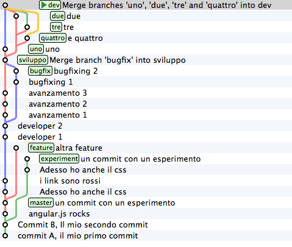
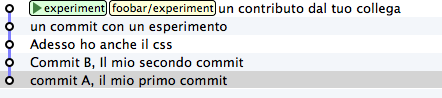
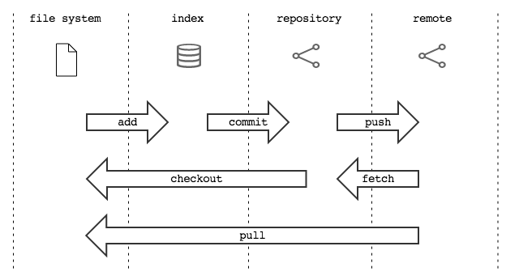
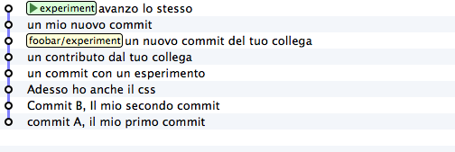

.. _obiettivo_6:

Obiettivo 6: mettere il ``repository`` in rete
##############################################

Fino ad ora hai interagito solo con il tuo ``repository`` locale, ma ti
avevo anticipato che git è un sistema *peer-to-peer*.

In generale, questo significa che il tuo ``repository`` è un nodo che
può entrare a far parte di una rete e scambiare informazioni con altri
nodi, cioè con altri ``repository``.

A parte il tuo ``repository`` locale, qualsiasi altro ``repository``
--non importa che si trovi su GitHub, su un server aziendale o
semplicemente in un'altra directory del tuo computer-- per git è un
``remote``.

Per collegare il tuo ``repository`` locale ad un ``remote`` ti basta
fornire a git l'indirizzo del ``repository`` remoto con il comando
``git remote`` (naturalmente, devi anche disporre dei permessi di
lettura o scrittura sul ``remote``)

Per rendere le cose semplici, facciamo un esempio concreto senza stare a
coinvolgere server esterni e internet; crea un altro ``repository`` da
qualche parte sul tuo stesso computer

.. code-block:: bash

    cd ..
    mkdir repo-remoto
    cd repo-remoto
    git init

In questo caso, dalla directory del tuo progetto il ``repository``
remoto sarà raggiungibile tramite il path ``../repo-remoto`` o col suo path
assoluto. Più comunemente, però, avrai a che fare con ``repository``
remoti raggiungibili, a seconda del protocollo utilizzato, con indirizzi
come

-  ``https://azienda.com/repositories/cool-project2.git``
-  ``git@github.com:johncarpenter/mytool.git``.

Per esempio, il ``repository`` di questa guida ha l'indirizzo
 
-  ``git@github.com:arialdomartini/get-git.git``.

Capita molto spesso, anche, che l'accesso ai ``remote`` richieda
un'autenticazione. In questo caso, di solito, si usano una coppia nome
utente/password o una chiave ssh.

Torna nel tuo progetto

.. code-block:: bash

    cd ../progetto

Bene. Aggiungi all'elenco dei ``remote`` il ``repository`` appena
creato, indicando a git un nome qualsiasi e l'indirizzo  del ``remote``

.. code-block:: bash

    git remote add foobar ../repo-remoto

Ottimo. Hai connesso il tuo ``repository`` ad un altro nodo. Sei
ufficialmente in una rete *peer-to-peer* di ``repository``. Da questo
momento, quando vuoi riferirti a quel ``repository`` remoto utilizzerai
il nome ``foobar``.

Il nome è necessario perché, a differenza di SVN che ha il concetto di
*server centrale*, in git puoi essere collegato ad un numero qualsiasi
di ``repository`` remoti contemporaneamente, per cui ad ognuno
assegnerai un nome identificativo univoco.

Sono due le cose che fondamentalmente puoi fare con un ``remote``:
allinearsi al suo contenuto o chiedere che sia lui ad allinearsi a te.

Hai a disposizione due comandi: ``push`` e ``fetch``.

Con ``push`` puoi *spedire* un set di ``commit`` al ``repository``
remoto. Con ``fetch`` puoi *riceverli* dal ``repository`` remoto

Sia ``push`` che ``fetch``, in realtà, permettono al tuo ``repository``
e al ``remote`` di scambiarsi delle etichette. E, in realtà, hai a
disposizione anche altri comandi. Ma andiamo per gradi: iniziamo a
vedere in concreto come funzioni la comunicazione tra un ``repository``
ed un ``remote``.

Spedire un ramo con ``push``
============================

Al momento il ``remote`` che hai chiamato ``foobar`` è un ``repository``
completamente vuoto: lo hai appena creato. Il tuo ``repository`` locale,
invece, contiene molti ``commit`` e molti ``branch``:

Prova a chiedere al ``repository`` remoto di darti i ``commit`` e i
``branch`` di cui dispone e che tu non hai. Se non indichi un ``branch``
specifico il ``repository`` remoto cercherà di darteli tutti. Nel tuo
caso il ``remote`` è vuoto, quindi non dovrebbe restituirti nulla

.. code-block:: bash

    git fetch foobar

Infatti. Non ricevi nulla. 

Prova, invece, a spedire il ramo
``experiment``

.. code-block:: bash

    git push foobar experiment
    Counting objects: 14, done. 
    Delta compression using up to 4 threads. 
    Compressing objects: 100% (8/8), done. 
    Writing objects: 100% (14/14), 1.07 KiB \| 0 bytes/s, done.
    Total 14 (delta 3), reused 0 (delta 0) To ../repo-remoto
    [new branch] experiment -> experiment

Wow! Qualcosa è successo! Di tutti i messaggi di risposta, quello più
interessante in questo momento è l'ultimo

.. code-block:: bash

    [new branch] experiment -> experiment

Ti aiuto a interpretare quello che è successo:

-  con ``git push foobar experiment`` hai chiesto a git di spedire a
   ``foobar`` il ramo ``experiment``
-  per eseguire il comando git ha preso in considerazione il tuo ramo
   ``experiment`` ed ha ricavato l'elenco di tutti i ``commit``
   raggiungibili da quel ramo (come al solito: sono tutti i ``commit``
   che puoi trovare partendo da ``experiment`` e seguendo a ritroso nel
   tempo qualsiasi percorso tu possa percorrere)
-  git ha poi contattato il ``repository`` remoto ``foobar`` per sapere
   quali di quei ``commit`` non fossero presenti remotamente
-  dopo di che, ha creato un pacchetto con tutti i ``commit`` necessari,
   li ha inviati ed ha chiesto al ``repository`` remoto di aggiungerli
   al proprio database
-  il ``remote`` ha poi posizionato il proprio ``branch`` ``experiment``
   perché puntasse esattamente lo stesso ``commit`` puntato sul tuo
   ``repository`` locale. Il ``remote`` non aveva quel ``branch``, per
   cui lo ha creato.

Prova adesso a visualizzare il ``repository`` remoto

.. figure:: img/remote-1.png

Vedi? Il ``remote`` non è diventato una copia del tuo ``repository``:
contiene solo il ``branch`` che gli hai spedito.

Puoi verificare che i 4 ``commit`` siano davvero tutti e soli i
``commit`` che avevi in locale sul ramo ``experiment``.

Anche sul tuo ``repository`` locale è successo qualcosa. Prova a
visualizzarlo

.. figure:: img/push-1.png

Guarda guarda! Sembra sia stato aggiunto un nuovo ``branch``, chiamato
``foobar/experiment``. E sembra anche si tratti di un ``branch`` un po'
particolare, perché l'interfaccia grafica si preoccupa di disegnarlo di
colore differente.

Prova a cancellare quel ``branch``

.. code-block:: bash

    git branch -d foobar/experiment
    error: branch 'foobar/experiment' not found.

Non può essere cancellato. git dice che quel ``branch`` non esiste. Uhm.
Decisamente quell'etichetta ha qualcosa di particolare.

Il fatto è che quel ``branch`` non è sul tuo ``repository``: è su
``foobar``. git ha aggiunto un ``remote branch`` per permetterti di
tenere traccia del fatto che, su ``foobar`` il ``branch`` ``experiment``
punta proprio a quel ``commit``.

I ``remote branch`` sono una sorta di reminder che ti permettono di
capire dove si trovino i ``branch`` sui ``repository`` remoti ai quali
sei collegato.

Si tratta di uno di quegli argomenti che risultano meno chiari
ai nuovi utenti di git, ma se ci pensi il concetto non è affatto
difficile. Con il ``remote branch`` chiamato ``foobar/experiment`` git ti
sta semplicemente dicendo che sul ``repository`` ``foobar`` il ``branch``
``experiment`` si trova in corrispondenza di quel ``commit``.

Così come non puoi cancellare quel ``branch`` non puoi nemmeno spostarlo
direttamente. L'unico modo per avere un controllo diretto di quel ``branch``
è accedere direttamente al ``repository`` ``foobar``.

Hai però modo di controllarne indirettamente la posizione inviando con ``push`` un
aggiornamento del ramo ``experiment``; avevamo visto prima che, effettivamente, 
la richiesta di ``push`` è sempre accompagnata dalla richiesta di aggiornamento della
posizione del proprio ``branch``.

Prima di provare con un esempio concreto, vorrei richiamare la tua attenzione su un aspetto molto importante 
a cui dovrai fare l'abitudine: mentre stavi leggendo queste righe
un tuo collega potrebbe aver aggiunto qualche ``commit`` proprio sul suo
ramo ``experiment`` sul ``repository`` remoto, e tu non ne sapresti
niente, perché il tuo ``repository`` non è collegato in tempo reale con
i suoi ``remote``, ma si sincronizza solo quando ci interagisci con gli
appositi comandi. Per cui, il ``commit`` puntato da
``foobar/experiment`` è da intendersi come l'ultima posizione nota del
ramo ``experiment`` su ``foobar``.

Ricevere aggiornamenti con ``fetch``
====================================

Guarda: proviamo proprio a simulare quest'ultimo caso caso. 
Modifica `foobar` come se un tuo collega stesse lavorando su ``experiment``. 

Cioè: aggiungi un ``commit`` sul ramo ``experiment`` di ``foobar``

.. code-block:: bash

    cd ../repo-remoto
    touch x
    git add x
    git commit -m "un contributo dal tuo collega" 

Ecco il risultato finale su ``foobar``

.. figure:: img/push-2.png

Torna pure al tuo ``repository`` locale e vediamo cos'è cambiato

.. code-block:: bash

    cd ../progetto

.. figure:: img/push-1.png

Infatti. Non è cambiato niente di niente. Il tuo ``repository`` locale
continua a dirti che il ramo ``experiment`` su ``foobar`` si trova a
"*un commit con un esperimento*\ ". E tu sai benissimo che non è vero!
``foobar`` è andato avanti, e il tuo ``repository`` non lo sa.

Tutto questo è coerente con quel che ti ho detto prima: il tuo
``repository`` non è collegato in tempo reale con i suo ``remote``; ci
si allinea solo a comando.

Chiedi allora al tuo ``repository`` di allinearsi con ``foobar``. Puoi
chiedere un aggiornamento su un singolo ramo o un aggiornamento su tutti
i rami. Di solito, si sceglie la seconda strada

.. code-block:: bash

    git fetch foobar
    remote: Counting objects: 3, done. remote:
    Compressing objects: 100% (2/2), done. remote: Total 2 (delta 1),
    reused 0 (delta 0) Unpacking objects: 100% (2/2), done. 
    From ../repo-remoto
    e5bb7c4..c8528bb experiment -> foobar/experiment

Qualcosa è arrivato.

Guarda di nuovo il ``repository`` locale. (Per renderci la vita più
semplice, iniziamo a sfruttare un'opzione ci cui la quasi totalità delle
interfacce grafiche di git è provvista: la possibilità di visualizzare
un singolo ramo e nascondere tutti gli altri, così da semplificare il
risultato finale)

Guarda attentamente quello che è successo: il tuo ramo ``experiment``
non si è spostato di una virgola. Se controlli, anche il tuo
``file system`` non è cambiato di un solo bit. Solo il tuo
``repository`` locale è stato aggiornato: git ci ha aggiunto un nuovo
``commit``, lo stesso aggiunto remotamente; in concomitanza, git ha
anche aggiornato la posizione di ``foobar/experiment``, per comunicarti
che "*dalle ultime informazioni di cui si dispone, l'ultima posizione
registrata su ``foobar`` del ramo ``experiment`` è questa*\ ".

Questo è il modo in cui, normalmente, git ti permette di sapere che
qualcuno ha proseguito il proprio lavoro su un ``repository`` remoto.

Un'altra osservazione importante: ``fetch`` non è l'equivalente di
``svn update``; solo il tuo ``repository`` locale si è sincronizzato con
quello remoto; il tuo ``file system`` non è cambiato! Questo significa
che, in generale, l'operazione di ``fetch`` è molto sicura: anche
dovessi sincronizzarti con un ``repository`` di dubbia qualità, puoi
dormire sonni tranquilli, perché l'operazione non eseguirà mai il
``merge`` sul tuo codice senza il tuo esplicito intervento.

Se invece tu volessi davvero includere i cambiamenti introdotti
remotamente nel *tuo* lavoro, potresti usare il comando ``merge``.

.. code-block:: bash

    git merge foobar/experiment

Riconosci il tipo di ``merge`` che ne è risultato? Sì, un
``fast-forward``. Interpretalo così: il tuo ``merge`` è stato un
``fast-forward`` perché mentre il tuo collega lavorava il ramo non è
stato modificato da nessun altro; il tuo collega è stato il solo ad
avervi aggiunto contributi e lo sviluppo è stato lineare.

Questo è un caso così comune che spesso vorrai evitare di fare
``git fetch`` seguito da ``git merge``: git offre il comando
``git pull`` che esegue le due operazioni insieme.

Insomma, invece di

.. code-block:: bash

    git fetch foobar
    git merge foobar/experiment

avresti potuto lanciare

.. code-block:: bash

    git pull foobar experiment

Possiamo estendere il diagramma delle interazioni tra i comandi di git e
i suoi ambienti aggiungendo la colonna ``remote`` e l'azione di
``push``, ``fetch`` e ``pull``

Sviluppo non lineare
===================

Proviamo a complicare la situazione. Vorrei mostrarti un caso che ti
capiterà continuamente: quello in cui due sviluppatori stiano lavorando
contemporaneamente su un ramo, su due ``repository`` separati. Di solito
accade che, proprio nel momento in cui vorrai spedire al ``remote`` i
tuoi nuovi ``commit``, vieni a scoprire che, nel frattempo, qualcuno sul
``repository`` remoto ha modificato il ``branch``.

Inizia a simulare l'avanzamento dei lavori del tuo collega, aggiungendo
un ``commit`` sul suo ``repository``

.. code-block:: bash

    cd ../repo-remoto
    touch avanzamento && git add avanzamento
    git commit -m "un nuovo commit del tuo collega"

.. figure:: img/collaborating-1.png

(En passant, nota una cosa: sul ``repository`` remoto non c'è alcuna
indicazione del tuo ``repository``; git è un sistema peer-to-peer
asimmetrico)

Torna al tuo ``repository``

Come prima: fintanto che non chiedi esplicitamente un allineamento con
``fetch`` il tuo ``repository`` non sa nulla del nuovo ``commit``.

Questa, per inciso, è una delle caratteristiche notevoli di git: essere
compatibile con la natura fortemente non lineare delle attività di
sviluppo. Pensaci: quando due sviluppatori lavorano su un solo branch,
SVN richiede che ogni ``commit`` sia preceduto da un ``update``; cioè,
che per poter registrare una modifica lo sviluppatore debba integrare
preventivamente il lavoro dell'altro sviluppatore. Non puoi eseguire un
``commit`` se prima non integri i ``commit`` del tuo collega. git, da
questo punto di vista, è meno esigente: gli sviluppatori possono
divergere localmente, perfino lavorando sullo stesso ``branch``; la
decisione se e come integrare il loro lavoro può essere intenzionalmente
e indefinitamente spostata avanti nel tempo.

In ogni modo: abbraccia la natura fortemente non lineare di git e,
deliberatamente ignorando che potrebbero esserci stati avanzamenti sul
``repository`` remoto, procedi senza indugio con i tuoi nuovi ``commit``
in locale

.. code-block:: bash

    cd ../progetto
    touch mio-contributo && git add mio-contributo
    git commit -m "un mio nuovo commit"

.. figure:: img/collaborating-2.png

Rifacciamo un punto della situazione su quel che ti ho appena descritto:

-  il tuo ``repository`` non sa del nuovo ``commit`` registrato su
   ``foobar`` e continua a vedere una situazione non aggiornata
-  a partire dal medesimo ``commit`` "*un contributo dal tuo collega*\ "
   tu e l'altro sviluppatore avete registrato due ``commit``
   completamente indipendenti.

Aver lavorato concorrentemente sullo stesso ramo, con due ``commit``
potenzialmente incompatibili, se ci pensi, è un po' come lavorare
concorrentemente sullo stesso file, con modifiche potenzialmente
incompatibili: quando si metteranno insieme i due risultati, c'è da
aspettarsi che venga segnalato un conflitto.

E infatti è proprio così. Il conflitto nasce nel momento in cui si
cercherà di sincronizzare i due ``repository``. Per esempio: prova a
spedire il tuo ramo su ``foobar``

.. code-block:: bash

    git push foobar experiment
    To ../repo-remoto ! [rejected]
    experiment -> experiment (fetch first) 
    error: failed to push some refs to '../repo-remoto' 
    hint: Updates were rejected because the remote contains work that you do 
    hint: not have locally. This is usually caused by another repository pushing 
    hint: to the same ref.  You may want to first integrate the remote changes 
    hint: (e.g., 'git pull ...') before pushing again. 
    hint: See the 'Note about fast-forwards' in 'git push --help' for details.

Rejected. Failed. Error. Più che evidente che l'operazione non sia
andata a buon fine. Ed era prevedibile. Con
``git push foobar experiment`` avevi chiesto a ``foobar`` di portare a
termine due operazioni:

-  salvare nei proprio database tutti i ``commit`` di cui tu disponi e
   che remotamente ancora non sono presenti
-  spostare la propria etichetta ``experiment`` in modo che puntasse
   allo stesso ``commit`` puntato in locale

Ora: per la prima operazione non ci sarebbe stato alcun problema. Ma per
la seconda operazione git pone un vincolo aggiuntivo: il ``repository``
remoto sposterà la propria etichetta solo a patto che l'operazione si
possa concludere con un ``fast-forward``, cioè, solo a patto che non ci
siano da effettuare dei ``merge``. Oppure, detta con altre parole: un
``remote`` accetta ``branch`` solo se l'operazione non creerà linee di
sviluppo divergenti.

Il ``fast-forward`` è citato proprio nell'ultima riga del messaggio di
errore

.. code-block:: bash

    hint: **See the 'Note about fast-forwards'** in 'git push --help'
    for details.<br/

Nello stesso messaggio git fornisce un suggerimento: ti dice di provare
a fare ``fetch``. Proviamo

.. code-block:: bash

    git fetch foobar

.. figure:: img/collaborating-3.png

La situazione dovrebbe essere chiara già a colpo d'occhio. Si vede che
le due linee di sviluppo stanno divergendo. La posizione dei due rami
aiuta a capire dove ti trovi in locale e dove si trovi il tuo collega
sul ``remote`` ``foobar``.

Resta solo da decidere cosa fare. A differenza di SVN, che di fronte a
questa situazione avrebbe richiesto necessariamente un merge in locale,
git ti lascia 3 possibilità

-  **andare avanti ignorando il collega**: puoi ignorare il lavoro del
   tuo collega e proseguire lungo la tua linea di sviluppo; certo, non
   potrai spedire il tuo ramo su ``foobar``, perché è incompatibile col
   lavoro del tuo collega (anche se puoi spedire il tuo lavoro
   assegnando alla tua linea di sviluppo un altro nome creando un nuovo
   ``branch`` e facendo il ``push`` di quello); comunque, il concetto è
   che non sei costretto ad integrare il lavoro del tuo collega;
-  **``merge``**: puoi fondere il tuo lavoro con quello del tuo collega
   con un ``merge``
-  **``rebase``**\ puoi riallinearti al lavoro del tuo collega con un
   ``rebase``

Prova la terza di queste possibilità. Anzi, per insistere sulla natura
non lineare di git, prova a far precedere alla terza strada la prima. In
altre parole, prova a vedere cosa succede se, temporaneamente, ignori il
disallineamento col lavoro del tuo collega e continui a sviluppare sulla
tua linea. È un caso molto comune: sai di dover riallinearti, prima o
poi, col lavoro degli altri, ma vuoi prima completare il tuo lavoro. git
non ti detta i tempi e non ti obbliga ad anticipare le cose che non vuoi
fare subito

.. code-block:: bash

    echo modifica >> mio-contributo
    git commit -am "avanzo lo stesso"

.. figure:: img/collaborating-4.png

Benissimo. Sei andato avanti col tuo lavoro, disallineandoti ancora di
più col lavoro del tuo collega. Supponiamo tu decida sia arrivato il
momento di allinearsi, per poi spedire il tuo lavoro a ``foobar``.

Potresti fare un ``git merge foobar/experiment`` ed ottenere questa
situazione

.. figure:: img/collaborating-5.png

Vedi? Adesso ``foobar/experiment`` potrebbe essere spinto in avanti (con
un ``fast-forward``) fino a ``experiment``. Per cui, a seguire, potresti
fare ``git push foobar``.

Ma invece di fare un ``merge``, fai qualcosa di più raffinato: usa
``rebase``. Guarda nuovamente la situazione attuale

.. figure:: img/collaborating-3.png

Rispetto ai lavori su ``foobar`` è come se tu avessi staccato un ramo di
sviluppo ma, disgraziatamente, mentre tu facevi le tue modifiche,
``foobar`` non ti ha aspettato ed è stato modificato.

Bene: se ricordi, ``rebase`` ti permette di applicare tutte le tue
modifiche ad un altro ``commit``; potresti applicare il tuo ramo a
``foobar/experiment``. È un po' come se potessi staccare di netto il
tuo ramo ``experiment`` per riattaccarlo su un'altra base
(``foobar/experiment``)

Prova

.. code-block:: bash

    git rebase foobar/experiment

Visto? A tutti gli effetti appare come se tu avessi iniziato il tuo
lavoro *dopo* la fine dei lavori su ``foobar``. In altre parole:
``rebase`` ha apparentemente reso lineare il processo di sviluppo, che
era intrinsecamente non lineare, senza costringerti ad allinearti con il
lavoro del tuo collega esattamente nei momenti in cui aggiungeva
``commit`` al proprio ``repository``.

Puoi spedire il tuo lavoro a ``foobar``: apparirà come tu abbia
apportato le tue modifiche a partire dall'ultimo ``commit`` eseguito su
``foobar``.

.. code-block:: bash

    **git push foobar experiment**\  
    Counting objects: 6, done. 
    Delta compression using up to 4 threads. 
    Compressing objects: 100% (4/4), done. 
    Writing objects: 100% (5/5), 510 bytes \| 0 bytes/s, done.
    Total 5 (delta 2), reused 0 (delta 0) 
    remote: error: refusing to update checked out branch: refs/heads/experiment 
    remote: error: By default, updating the current branch in a non-bare repository
    remote: error: is denied, because it will make the index and work
    tree >inconsistent 
    remote: error: with what you pushed, and will require 'git reset --hard' to match 
    remote: error: the work tree to HEAD. 
    remote: error: remote: error: You can set 'receive.denyCurrentBranch' configuration variable to 
    remote: error: 'ignore' or 'warn' in the remote repository to allow pushing into
    remote: error: its current branch; however, this is not recommended unless you 
    remote: error: arranged to update its work tree to match what you pushed in some remote: error: other way. 
    remote: error:
    remote: error: To squelch this message and still keep the default behaviour, set 
    remote: error: 'receive.denyCurrentBranch' configuration variable to 'refuse'. 
    To ../repo-remoto ! [remote rejected] experiment -> experiment (branch is currently checked out)
    error: failed to push some refs to '../repo-remoto'

Mamma mia! Sembra proprio che a git questo ``push`` non sia piaciuto.
Nel lunghissimo messaggio di errore git ti sta dicendo di non poter fare
``push`` di un ``branch`` attualmente "*checked out*\ ": il problema non
sembra essere nel ``push`` in sé, ma nel fatto che sull'altro
``repository`` il tuo collega abbia fatto ``checkout experiment``.

Questo problema potrebbe capitarti di continuo, se non sai come
affrontarlo, per cui a breve gli dedicheremo un po' di tempo. Per
adesso, rimedia chiedendo gentilmente al tuo collega di spostarsi su un
altro ramo e ripeti il ``push``.

Quindi: su ``foobar`` vedi di spostarti su un altro ``branch``

.. code-block:: bash

    cd ../repo-remoto
    git checkout -b parcheggio

Dopo di che, torna al tuo ``repository`` locale e ripeti ``push``

.. code-block:: bash

    cd ../progetto
    git push foobar experiment

Ecco il risultato

.. figure:: img/collaborating-7.png

Ripercorriamo graficamente quello che è successo. Partivi da

.. figure:: img/collaborating-4.png

Poi hai fatto ``rebase`` ed hai ottenuto

Poi hai fatt ``push`` su ``foobar``: la nuova posizione del
``remote branch`` ``foobar/experiment`` testimonia l'avanzamento del
ramo anche sul ``repository`` remoto.

.. figure:: img/collaborating-7.png

Contestualmente, il tuo collega su ``foobar`` ha visto passare il
proprio ``repository`` da

.. figure:: img/collaborating-1.png

a

.. figure:: img/collaborating-8.png

Ti torna tutto? Ecco, guarda attentamente le ultime due immagini, perché
è proprio per evitare quello che vedi che git si è lamentato tanto,
quando hai fatto ``git push foobar experiment``.

Per capirlo, mettiti nei panni del tuo collega virtuale, che abbiamo
immaginato sul ``repository`` remoto ``foobar``. Il tuo collega se ne
sta tranquillo sul suo ramo ``experiment``

.. figure:: img/collaborating-1.png

quando ad un tratto, senza che abbia dato alcun comando a git, il suo
``repository`` accetta la tua richiesta di ``push``, salva nel database
locale un paio di nuovi ``commit`` e sposta il ramo ``experiment`` (sì,
proprio il ramo di cui aveva fatto il ``checkout``!) due ``commit`` in
avanti

.. figure:: img/collaborating-8.png

Ammetterai che se questo fosse il comportamento standard di git non
vorresti mai trovarti nella posizione del tuo collega virtuale: la
perdita di controllo del proprio ``repository`` e del proprio
``file system`` sarebbe davvero un prezzo troppo alto da pagare.

Capisci bene che cambiare il ramo del quale si è fatto ``checkout``
significa, sostanzialmente, vedersi cambiare sotto i piedi il
``file system``. Ovviamente questo è del tutto inaccettabile, ed è per
questo che git si è rifiutato di procedere ed ha replicato con un
chilometrico messaggio di errore.

Prima hai rimediato alla situazione spostando il tuo collega virtuale su
un ramo ``parcheggio``, unicamente per poter spedirgli il tuo ramo.

.. figure:: img/collaborating-9.png

Questo sporco trucco ti ha permesso di fare ``push`` di ``experiment``.

Ma a pensarci bene anche questa è una soluzione che, probabilmente, tu
personalmente non accetteresti mai: a parte la scomodità di doversi
interrompere solo perché un collega vuole spedirti del suo codice,
comunque non vorresti che l'avanzamento dei tuoi rami fosse
completamente fuori dal tuo controllo, alla mercé di chiunque. Perché,
alla fine, il ramo ``experiment`` si sposterebbe in avanti contro la tua
volontà, e lo stesso potrebbe accadere a tutti gli altri rami di cui non
hai fatto ``checkout``.

È evidente che debba esistere una soluzione radicale a questo problema.

La soluzione è sorprendentemente semplice: **non permettere ad altri di
accedere al tuo ``repository``**.

Potresti trovarla una soluzione un po' sommaria, ma devi riconoscere che
non esista sistema più drastico ed efficace. E, fortunatamente, è molto
meno limitante di quanto tu possa credere ad una prima analisi.

Naturalmente, ti ho raccontato solo metà della storia e forse vale la
pena di approfondire un po' l'argomento. Apri bene la mente, perché
adesso entrerai nel vivo di un argomento molto affascinante: la natura
distribuita di git. Si tratta, verosimilmente, dell'aspetto più
comunemente incompreso di git e, quasi certamente di una delle sue
caratteristiche più potenti.

:ref:`Indice <indice>` :: :ref:`Obiettivo 7: disegnare il workflow ideale <obiettivo_7>`
