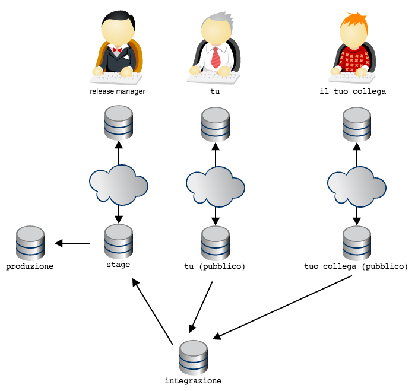

.. _obiettivo_7:

Obiettivo 7: disegnare il workflow ideale
###########################################

Se hai usato CVS e SVN sarai senz'altro abituato al concetto di
``repository`` centrale: tutti gli sviluppatori attingono e fanno
riferimento ad un'unica struttura centrale, dove è conservato il codice
sorgente.

.. figure:: img/workflow-1.png

Nell'esempio che abbiamo utilizzato fino ad ora il team era composto da
2 sviluppatori: tu ed il tuo collega. Ti sarai accorto che già con un
team di dimensione così ridotta l'organizzazione dei repository, con
git, ha qualcosa di particolare: prima di tutto perché ci sono due
``repository``; e poi perché, dei due ``repository``, non si capisce
bene quale sia quello *ufficiale*.

.. figure:: img/workflow-2.png

A complicare le cose c'è il fatto che, a quanto pare, non si dovrebbe
permettere ad altri di accedere al proprio ``repository``. Decisamente
la faccenda si fa confusa e nebulosa.

Cerchiamo di mettere chiarezza. Partiamo da un assunto: git è abbastanza
versatile da replicare totalmente l'organizzazione a ``repository``
centrale di SVN. Per cui, se proprio per te fosse uno shock culturale
insostenibile anche solo pensare di organizzare il tuo workflow in altro
modo, riproduci la struttura di SVN e vivi felice. Ti
uniresti ad un lungo elenco di aziende e di team che, di fronte alle
possibilità offerte da git, rimediano rifugiandosi nell'arcinota
architettura a ``repository`` centrale. 

È una opzione. Non è delle più felici, perché impedisce di godere di alcuni dei grandi
vantaggi dell'usare un sistema di versionamento distribuito, ma è sempre
un'opzione percorribile Un mio collega la descrive come "*avere
finalmente il fucile ed usarlo come una clava*\ ". Diciamo pure che non
è l'opzione che verrà promossa da questa guida.

In questo capitoletto proveremo piuttosto ad esplorare altre
implementazioni meno banali.

Partiamo da un'euristica che io ho sempre trovato molto efficace:

    utilizza una topologia di ``repository`` che rispecchi il reale
    flusso di lavoro e i reali ruoli funzionali esistenti nel team

Tradotto in soldoni e applicato al nostro caso concreto: tu e il tuo
collega state usando git principalmente per 3 funzioni

-  tu, per sviluppare il codice
-  il tuo collega, per sviluppare il codice
-  entrambi, per scambiarvi il codice ed integrare il lavoro di entrambi

L'idea è: per ogni funzione, usa un ``repository`` dedicato. In altre
parole, potreste prendere in considerazione l'ipotesi di aggiungere un
``repository``, raggiungibile sia da te che dal tuo collega, da
utilizzare come area di integrazione

.. figure:: img/workflow-3.png

Ora: verrebbe già più spontaneo eleggere il ``repository``
``integrazione`` come il ``repository`` ufficiale, non trovi?

A rigore, non c'è fisicamente niente che caratterizzi il repository
``integrazione`` come \ ``repository`` centrale: tecnicamente è del tutto
equivalente agli altri due. L'idea di fondo che è che il ruolo e
l'importanza di un ``repository`` rispetto ad un altro sia una questione
sociale e organizzativa, non imposta da vincoli o limiti tecnologici:
git si limita a permettere di modellarla, ma non impone la minima
opinione in materia.

Quindi, supponiamo che, per convenzione o per accordo tra le parti si
decida che il repository ``integrazione`` venga usato per permettere
l'integrazione tra il lavoro tuo e quello del tuo collega e come
archivio *ufficiale*; gli altri due ``repository`` saranno da intendersi
come archivi ad uso esclusivo di ogni sviluppatore.

Puoi rinforzare questa struttura utilizzando un paio di strumenti che
git ti mette a disposizione.

Per prima cosa, potresti creare il repository ``integrazione`` con il
comando ``git init --bare``; l'opzione ``--bare`` fa in modo che il
``repository`` non possa essere utilizzato come base di lavoro: verrà
creato solo il database, senza il ``file system``, per cui non sarà
possibile fare ``add`` e ``checkout``

Invece, sui due ``repository`` personali, potresti configurare ad arte i
permessi di accesso, restringendoli ai soli proprietari; tu sarai il solo
a poter leggere e scrivere sul tuo ``repository`` personale, e non avrai
modo di accedere a quello del tuo collega; e vice versa. Vi perdete la
possibilità di spedirvi ``branch`` senza passare dal ``repository``
centrale, ma a breve vedremo delle configurazioni più articolate.

.. figure:: img/workflow-4.png

Ecco qui: hai una topologia molto simile alla soluzione centralizzata di
SVN, con la sola differenza che ogni sviluppatore dispone di un
``repository`` privato locale.

Possiamo fare di più? Certo che sì. Se ne vale la pena. Nello specifico:
se l'intero team di sviluppo è costituito da te e dal tuo collega,
questa soluzione potrebbe già essere perfetta.

Ma le cose potrebbero essere molto differenti: considera per esempio il
caso in cui il tuo collega sia un consulente esterno, al quale non vuoi
dare direttamente la possibilità di modificare direttamente il codice
nel ``repository`` ufficiale se non dopo una tua revisione ed
accettazione del codice.

Una possibilità potrebbe essere quella di decidere che sia il *tuo*
``repository`` quello ufficiale, così da organizzare i tool di Continuous
Integration e di Deployment perché prelevino il codice da lì. Oppure,
potresti ripensare all'euristica

    utilizza una topologia di ``repository`` che rispecchi il reale
    flusso di lavoro e i reali ruoli funzionali esistenti nel team

e decidere di aggiungere un nuovo ``repository`` con il ruolo di
*archivio ufficiale* del codice pronto ad andare in produzione e
restringere l'accesso in scrittura solo a te

.. figure:: img/workflow-5.png

Inizi ad intuire che questa storia dei ``repository`` offra una gamma
pressocché illimitata di possibilità?

Guarda: voglio mostrarti una configurazione topologica che è molto
diffusa e che sicuramente incontrerai, specialmente dovessi partecipare
a qualche progetto *open source* su GitHub.

Considera di nuovo l'ultima illustrazione. Il tuo ``repository`` e
quello del tuo collega sono sicuramente ``repository`` locali, ospitati
sulle rispettive macchine di sviluppo. Generalmente, quindi, non sono
``repository`` facilmente accessibili dall'esterno. Quindi, quando avevo
disegnato lo schema

.. figure:: img/workflow-2.png

ero stato molto superficiale e frettoloso, perché avevo del tutto
sorvolato sul problema, tutt'altro che banale, di come far comunicare i
due ``repository``, ospitati probabilmente su due *laptop*, senza IP
fisso o dominio: una condivisione di cartelle con Samba? Un server ssh
installato su entrambi i *laptop*? Dropbox?

Una delle soluzioni più di successo sembra suggerita da un aforisma di
David Wheeler che recita

    *All problems in computer science can be solved by another level of
    indirection*

In git potrebbe valere una legge simile: quando hai un problema di
workflow, prova a modellare la tua topologia di ``repository``
aggiungendo un nuovo livello di indirezione.

Applicato al nostro caso, potremmo pensare di fornire a te e al tuo
collega non un singolo ``repository`` ciascuno, ma una coppia di
``repository``: uno ad uso privato, per sostenere le attività di
sviluppo, ed uno pubblico, per consentire la reciproca comunicazione

.. figure:: img/workflow-6.png

Quindi: ogni sviluppatore dispone del proprio ``repository`` privato di
lavoro, e di un ``repository`` pubblico. Tutti possono accedere al
``repository`` pubblico di chiunque, ma solo il legittimo proprietario
può scriverci (nel grafico, per semplicità, è inteso che chiunque possa
accedere in lettura a qualunque ``repository`` pubblico).

Ecco: questa è la tipica organizzazione di un'azienda che abbia adottato
il workflow di GitHub.

Sono possibili innumerevoli variazioni di questa organizzazione base.
Per esempio: il team potrebbe prevedere che il codice vada in produzione
in pacchetti di funzionalità decise da un ``release manager``

.. figure:: img/workflow-7.png

In questa topologia si è deciso che il ``repository`` dal quale si
preleva il codice per il deployment in produzione sia il ``repository``
pubblico del *release manager*: il *release manager* preleva il codice
da ``integrazione``. Il flusso di lavoro è garantito dal fatto che il
*release manager* sia l'unico a disporre dei diritti di ``push`` sul
proprio ``repository`` pubblico.

Facciamo un altro esempio: si potrebbe decidere che il prodotto debba
sempre passare da un ambiente di stage (per esempio, un ambiente di
produzione solo per utenti abilitati al *beta testing*)

Nota come l'organizzazione, in git, sia ottenuta non limitando le
letture (sostanzialmente, in tutti questi schemi tutti hanno diritti di
lettura su qualsiasi ``repository`` pubblico), ma garantendo i permessi
di scrittura su ``repository`` solo ai proprietari designati; sarà poi
la convenzione sociale a stabilire a quale uso destinare ogni
``repository`` (collegando, per esempio, gli script di deployment ad un
``repository`` piuttosto che ad un altro).

Si potrebbe immaginare la topologia dei ``repository`` come un sistema
di vasche comunicanti; in ogni vasca si può far fluire selettivamente il
codice da una o più altre vasche comunicanti; ad ogni persona che
ricopra un determinato ruolo nel flusso di lavoro viene dato il
controllo esclusivo della chiusa che apre o chiude il flusso di codice
nella propria vasca.

In linea generale: tutti i tipi di workflow che prima con SVN si era
costretti ad implementare usando convenzioni sui nomi e sugli usi dei
branch, in git sono molto facilmente modellabili con topologie di
``repository``. È un vero peccato quando un team che abbia adottato git
cerchi di riprodurre un controllo del workflow con gli stessi sistemi di
SVN, perché farà un grande sforzo per ottenere molto meno di quel che git
potrebbe fornire.

Ti accorgerai, invece, di come convenga quasi sempre modellare la rete
di ``repository`` in modo che rifletta il workflow e l'organizazione
gerarchica del tuo team. Per esempio, non è raro che in grandi
organizzazioni il flusso di lavoro sia abbastanza articolato da
richiedere più team, con una distribuzione gerarchica dei ruoli e delle
responsabilità: potrebbe esserci un responsabile del progetto a cui
riportano un paio di responsabili di team che, a loro volta, gestiscono
più persone. Ecco: è comune che in queste occasioni si tenda a modellare
la rete di ``repository`` ad immagine della gerarchia dei ruoli,
adottando quello che viene chiamato "*Dictator and Lieutenants
Workflow*\ "

.. figure:: img/dictator.png

Nota che quando i diagrammi delle topologie sono particolarmente
articolati, si rappresentano solo i ``repository`` pubblici, dando per
scontato che ogni persona adibita al controllo di quel ``repository``
pubblico (cioè, fornita dei diritti di ``push``) avrà un ``repository``
privato sulla propria macchina locale.

:ref:`Indice <indice>` :: :ref:`Daily git <dailygit>`
