# Introduzione

Questa guida è un po' diversa dalle altre.

Molte delle guide che ho letto su git si preoccupano di introdurti ai comandi base e lasciano ai capitoli più avanzati la descrizione del modello di funzionamento interno.

Quello che ho notato, però, è che imparando git partendo dai comandi base, rischi di finire per trovarlo uno strumento vagamente simile a SVN ma provvisto di un set aggiuntivo di comandi esoterici, il cui funzionamento ti resterà sostanzialmente oscuro.

Facci caso: alcuni di quelli che hanno imparato git abbasanza da riuscire ad usarlo quotidianamente ti racconteranno di aver fatto molta fatica a capire cosa sia un `rebase`, o di non cogliere esattamente che uso fare dell'`index`. 

La mia impressione è che, una volta capito il modello interno (che è stupefacentemente semplice!), tutto git appaia improvvisamente lineare e coerente: non c'è davvero alcun motivo per cui il `rebase` dovrebbe essere un argomento misterioso.

Questa guida prova a spiegarti git seguendo un percorso contrario a quello adottato di solito: partirai dalla spiegazione degli internal e finirai per imparare, nello stesso momento, sia comandi base che quelli avanzati, in poco tempo e senza troppi grattacapi.

# Non sono parente di SVN

Per chi arrivi da SVN, git presenta una sola difficoltà: ha molti comandi identici. Ma è una somiglianza superficiale e ingannevole: sotto il cofano git è totalmente differente.

Per questo ti suggerisco di rifuggire sempre dalla tentazione di fare dei paralleli con SVN, perché sarebbero solo fuorvianti. Troverai comandi come `add`, `checkout`, `commit` e `branch` che ti sembrerà di conoscere. Ecco: fai tabula rasa di quel che conosci, perché in git quei comandi significano cose molto molto differenti.

Cercare di capire git usando SVN come modello, a volte, porta semplicemente fuori strada.

Per esempio: ci crederesti che questo repository ha 3 branch?

Sì: 3 branch, non 2.

Oppure: ci crederesti che git, più che un sistema di versionamento del codice, potrebbe essere meglio descritto come un "*sistema peer-to-peer di database chiave/valore su file system*"?

Per cui: dimentica quello che sai sui branch e sui changeset di SVN, e preparati a concetti completamente nuovi.

Se siamo fortunati, li troverai molto più omogenei e potenti di quelli di SVN.

## Setup

Installa [git](http://git-scm.com/downloads).

Poi configuralo perché ti riconosca

> git config --global user.name "Arialdo Martini" 
> git config --global user.emal arialdomartini@gmail.com`

Se vuoi, installa anche un client grafico. Io ti suggerisco [SmartGit](http://www.syntevo.com/smartgithg/), che è gratuito per progetti OpenSource. Altrimenti appoggiati al tool `gitx` che trovi in bundle insieme all'installazione di git.

Fantastico. Partiamo.

# Gli internal di git
## 3 differenze principali

Iniziamo con tre caratteristiche di git con le quali dovresti familiarizzare.

1. **Non c'è un server**: il repository è locale. La gran parte delle operazioni è locale e non richiede l'accesso alla rete. Anche per questo troverai git  incredibilmente veloce.
2. **Il progetto è indivisibile**: git lavora sempre con l'intero codice sorgente del progetto e non su singole directory o su singoli file; con git non c'è differenza tra committare nella directory principale o in una sotto-directory. Non esiste il concetto di fare il checkout di un file o di una singola directory. Per git il progetto è l'unità indivisibile di lavoro.
3. **git non memorizza i cambiamenti dei file**: git salva sempre i file nella loro interezza. Se in un file di 2 mega modificassi un singolo carattere, git memorizzerebbe per intero la nuova versione del file. Questa è una differenza importante: SVN memorizza le differenze e, all'occorrenza, ricostruisce il file; git memorizza il file e, all'occorrenza, ricostruisce le differenze.

### 4 livelli di nerdosità

Sull'assenza di un server ho un po' mentito: come ti ho già detto e come vedrai più avanti, git è un sistema peer-to-peer, e riesce ad interagire con dei server remoti.
Nonostante questo resta sostanzialmente un sistema locale.

Per capire quanto questo possa avvantaggiarti, prova a vederla così: quando il codice sorgente di un progetto è ospitato su un computer remoto hai 4 modi per editare il codice

1. Lasci tutto il codice sul computer remoto e vi accedi con ssh per editare un singolo file
2. Trovi il modo di ottenere una copia del singolo file per poterci lavorare più comodamente in locale e lasci tutto il resto sul computer remoto
3. Trovi il modo di ottenere una copia locale di un intero albero del file system e lasci il resto della storia dei commit sul computer remoto
4. Ottenieni una copia locale dell'intero repository con tutta la storia del progetto e lavori in locale

Avrai notato due cose.

La prima, che SVN e i sistemi di versionamento ai quali sei probabilmente abituato operano al livello 3.

La seconda, che i 4 sistemi sono elencati in ordine di comodità: quando il materiale è conservato sul sistema remoto, normalmente, il tuo lavoro è più macchinoso, lento e scomodo. SVN ti permette di fare il checkout di un'intera directory proprio perché così ti risulti più comodo passare da un file all'altro senza dover continuamente interagire col server remoto.

Ecco: git è ancora più estremo; preferisce farti avere a disposizione tutto sul tuo computer locale; non solo il singolo checkout, ma l'intera storia del progetto, dal primo all'ultimo commit.

In effetti, qualunque cosa tu voglia fare, git chiede normalmente di ottenere una copia completa di quel che è presente sul server remoto. Ma non preoccuparti troppo: git è più veloce a ottenere l'intera storia del progetto di quanto SVN lo sia ad ottenere un singolo checkout.

### Il modello di storage

Passiamo dalla terza differenza. E preparati a conoscere il vero motivo per cui git sta sostituendo molto velocemente SVN come nuovo standard *de-facto*.

* SVN memorizza la collezione delle varie patch (o diff) applicate nel tempo ai file; all'occorrenza ricostruisce lo stato attuale;
* git memorizza i file così come sono, nella loro interezza; all'occorrenza ne calcola le diff.

Se vuoi evitare tanti grattacapi con git, il miglior suggerimento che tu possa seguire è di trattarlo come un **database chiave/valore**. 

Apri una console e vediamolo nel concreto.

Mettiti nella condizione di avere 2 file vuoti sul file system: 

> mkdir progetto 
> cd progetto 
> mkdir libs 
> touch libs/foo.txt 
> mkdir templates 
> touch templates/bar.txt 

    /
    ├──libs
    |     └──foo.txt
    |
    ├──templates
            └──bar.txt

Decidiamo di gestire il progetto con git

> git init

Aggiungi il primo file a git

> git add libs/foo.txt

Con questo comando, git ispeziona il contenuto del file (è vuoto!) e lo memorizza nel suo database chiave/valore, chiamato `blob storage` e conservato su file system nella directory nascosta `.git`. 

Siccome il `blob-storage` è un database chiave valore, git cercherà di calcolare una chiave ed un valore per il file che hai aggiunto. Per il valore git userà il contenuto stesso del file; per la chiave, verrà calcolato lo sha1 del contenuto (se sei curioso, nel caso di un file vuoto vale `e69de29bb2d1d6434b8b29ae775ad8c2e48c5391`)

Per cui, nel `blob storage` git salverà un oggetto `blob`, univocamente identificabile dalla sua chiave (che, in assenza di ambiguità, vale la pena di abbreviare)

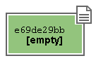

Adesso aggiungi il secondo file

> git add templates/bar.txt

Ora, siccome `libs/foo.txt` e `templates/bar.txt` hanno lo stesso identico contenuto (sono entrambi vuoti!), nel `blob storage` entrambi verranno conservati in un unico oggetto:

Come vedi, nel `blob storage` git ha memorizzato solo il contenuto del file, non il suo nome né la sua posizione.

Naturalmente, però, a noi il nome dei file e la loro posizione interessano eccome.
Per questo, nel `blob storage`, git memorizza anche altri oggetti, chiamati `tree` che servono proprio a memorizzare il contenuto delle varie directory e i nomi dei file.

Nel nostro caso, avremo 3 `tree` 

Come ogni altro oggetto, anche i `tree` sono memorizzati come chiave/valore.

Tutte queste strutture vengono raccolte dentro un contenitore, chiamato `commit`.

 

Come avrai intuito, un `commit` non è altro che un elemento del database chiave/valore, la cui chiave è uno SHA1, come per tutti gli altri oggetti, e il cui valore è un puntatore al `tree` del progetto, cioè la sua chiave (più un altro po' di informazioni, come il commento e l'autore). 
Non è troppo complicato, dopo tutto, no?

Quindi, il `commit` è l'attuale fotografia del file system.

Adesso fai

> git commit -m "commit A, il mio primo commit"

Stai dicendo a git: 

*memorizza nel repository, cioè nella storia del progetto, il commit che ti ho preparato a colpi di add*

Il tuo repository, visto da SmartGit, adesso ha questo aspetto

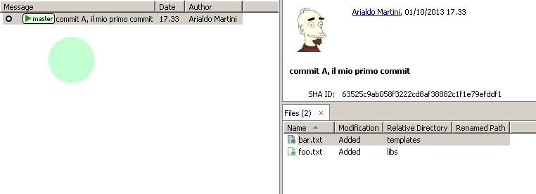

La riga col pallino che vedi sulla sinistra rappresenta l'oggetto `commit`. Nel pannello sulla destra, invece, puoi vedere la chiave del `commit`.

In generale, a meno che non si debba parlare proprio del modello interno come stiamo facendo adesso, non c'è una grande necessità di rappresentare tutta la struttura di `blob` e `tree` che costituisce un `commit`. Difatti, dopo il prossimo paragrafo inizieremo a rappresentare i `commit` come nella figura qui sopra: con un semplice pallino.

Già da adesso, comunque, dovrebbe risultarti più chiaro il fatto che dentro un `commit` ci sia l'intera fotografia del progetto e che, di fatto, un `commit` sia l'unità minima ed indivisibile di lavoro.

## L' `index` o `staging area` 

Sostanzialmente, non c'è molto altro che tu debba sapere del modello di storage di git. Ma prima di passare a vedere i vari comandi, vorrei introdurti ad un altro meccanismo interno: la `staging area` o `index`. L'`index` risulta sempre misterioso a chi arrivi da SVN: vale la pena parlarne perché quando si sa come funzionano il `blob storage` e l'`index`, git passa da sembrare un tool contorto e incomprensibile ad essere un oggetto molto lineare e coerente.

L'`index` è una struttura che fa da cuscinetto tra il file system e il repository. È un piccolo buffer che puoi utilizzare per costruire il prossimo `commit`. 

Non è troppo complicato:

 * il `file system` è la directory con i tuoi file.
 * il `repository` è il database locale su file, che conserva i vari `commit`
 * l'`index` è lo spazio che git ti mette a disposizione per creare il tuo prossimo `commit`.

Fisicamente, l'`index` non è molto diverso dal `repository`: entrambi conservano i dati nel `blob storage`, usando le strutture che hai visto prima.

In questo momento, appena dopo aver completato il tuo primo `commit`, l'`index` conserva una copia del commit e si aspetta che tu lo modifichi.

Sul file system hai

    /
    ├──libs
    |     └──foo.txt
    |
    ├──templates
            └──bar.txt

Proviamo a fare delle modifiche al file `foo.txt`

>  echo "nel mezzo del cammin" >> libs/foo.txt 

e aggiorna l'`index` con

> git add libs/foo.txt

All'esecuzione di `git add` git ripete quel che aveva già fatto prima: analizza il contenuto di `libs/foo.txt`, vede che c'è un contenuto che non ha mai registrato e quindi aggiunge al `blob storage` un nuovo `blob` col nuovo contenuto del file; contestualmente, aggiorna il `tree` `libs` perché il file `foo.txt` punti al suo nuovo contenuto

Prosegui aggiungendo un nuovo file `doh.html` alla root del progetto

>  echo "happy happy joy joy" > doh.html 
>  git add doh.html

Come prima: git aggiunge un nuovo `blob` object col contenuto del file e, contestualmente, aggiunge nel `tree` "/" un nuovo puntatore chiamato `doh.html` che punta al nuovo `blob` object

Il contenitore di tutta questa struttura è un oggetto `commit` che git tiene parcheggiato nella `staging area`.
Questa struttura rappresenta esattamente la nuova situazione sul file system.

Siccome però a noi interessa che git conservi anche la storia del nostro file system, ci sarà bisogno di memorizzare da qualche parte il fatto che questa nuova situazione (lo stato attuale dell'`index`) sia figlia della precedente situazione (il precedente `commit`).

In effetti, git aggiunge automaticamente al `commit` posteggiato nella `staging area` un puntatore al `commit` dal quale si proviene

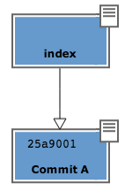

La freccia rappresenta il fatto che l'`index` è figlio del `commit A`. È un semplice puntatore. Nessuna sopresa, se ci pensi; git, dopo tutto, utilizza il solito, medesimo, semplicissimo modello ovunque: un database chiave/valore per conservare il dato, e una chiave come puntatore tra un elemento e l'altro.

Ok. Adesso committa

>  git commit -m "Commit B, Il mio secondo commit"

Con l'operazione di commit si dice a git "*Ok, prendi l'attuale `index` e falla diventare il tuo nuovo commit. Poi restituiscimi l'`index` così che possa fare una nuova modifica*"

Dopo il `commit` nel database di git avrai

Una breve osservazione: spesso le interfacce grafiche di git omettono di visualizzare l'`index`. `gitk`, per esempio, la visualizza solo se ci sono modifiche da committare. Il tuo repository in `gitk` adesso viene visualizzato così

Guarda tu stesso. Lancia

>  gitk

Ricapitolando:

1. git memorizza sempre i file nella loro interezza
2. il `commit` è uno dei tanti oggetti conservati dentro il database chiave/valore di git. È un contenitore di tanti puntatori ad altri oggetti del database: i `tree` che rappresentano directory con nomi di file che a loro volta puntano ad altri `tree` (sottodirectory) o a dei `blob` (il contenuto dei file)
3. ogni oggetto `commit` ha un puntatore al `commit` padre da cui deriva
4. l'`index` è uno spazio di appoggio nel quale puoi costruire, a colpi di `git add`, il nuovo `commit` 
5. con `git add` aggiungi un file all'`index`; con `git commit` registri l'attuale `index` facendolo diventare il nuovo `commit`.    

Bene: adesso hai tutta la teoria per capire i concetti più astrusi di git come il `rebase`, il `cherrypick`, l'`octopus-merge`, l'`interactive rebase`, il `revert` e il `reset`.

Passiamo al pratico.

# I comandi di git

## Obiettivo 1: tornare indietro nel tempo

Dunque, se in git tutto è conservato in un database chiave/valore, probabilmente ci saà modo per referenziare un qualunque oggetto del database usando la sua chiave.

In effetti è proprio così. 

Adesso proviamo a tornare indietro nel tempo, al `commit A`, utilizzando il comando `git checkout`.

Il comando `checkout` prende il commit indicato e lo copia nel file system e nella `staging area`.

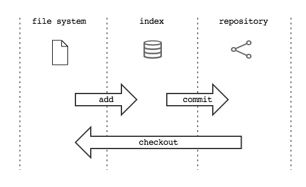

Già: ma qual è la chiave del `commit A`?
Lo scopriamo col comando `git log` che mostra tutto quello che abbiamo fatto fin'ora

> git log --oneline 
>**2a17c43** Commit B, Il mio secondo commit 
>**56674fb** commit A, il mio primo commit 

Occhio! Siccome nel commit vengono memorizzati anche la data e l'autore, le tue chiavi risulteranno diverse dalle mie.

La chiave del `commit A` è `56674fb`. Uhm, un po' scomodo come sistema. 
Comunque: torniamo indietro al passato, al momento del commit A

> ls 
> **doh.html&nbsp;&nbsp;&nbsp;&nbsp;libs&nbsp;&nbsp;&nbsp;&nbsp;templates** 
> git checkout 56674fb 
> ls 
> **libs&nbsp;&nbsp;&nbsp;&nbsp;templates** 

Effettivamente, a parte un misterioso e prolisso messaggio di con cui git si lamenta di essere in `'detached HEAD' state` (poi chiariremo questo punto), il file system è tornato allo stato del primo commit e, infatti, il file `doh.html` è scomparso.

##Obiettivo 2: divergere

Usando una convenzione grafica molto comune nella letteratura su git, potremmo rappresentare la situazione attuale del tuo repository con

> **A**---B

Cioè: ci sono due `commit`, `A` e `B`. Il `commit B` è figlio di `A` (il tempo scorre verso destra). Il `commit` in grassetto indica il punto dove ti trovi attualmente.

Che succederebbe se adesso facessi qualche modifica e committassi? 
Accadrebbe che il nuovo `commit C` che andresti a generare sarebbe figlio di `A` (perché è da lì che parti), ma la linea di svilupppo proseguirebbe divergendo dalla linea `A---B`.

Cioè, si creerebbe questa situazione

>  A---B 
>  &nbsp;&nbsp;\  
>  &nbsp;&nbsp;&nbsp;**C**

Proviamolo davvero:

>  echo "ei fu siccome immobile" > README.md 
>  git add README.md 
>  git commit -m "Ecco il commit C" 

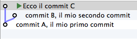

Hai ottenuto una diramazione, senza il meccanismo della copia utilizzato da SVN: il modello a chiave/valore e puntatori di git rende molto economico rappresentare una linea di sviluppo che diverge.

Due osservazioni importanti.
 
La prima per ribadire il concetto che git non ha mai memorizzato i "diff" tra i file: `A`, `B` e `C` sono snapshot dell'intero progetto. È molto importante ricordarselo, perché ti aiuterà a capire che tutte le considerazioni che sei sempre stato abituato a fare con SVN qui non valgono.

La seconda è un po' sorprendente: le due linee di sviluppo divergenti che hai appena visto non sono `branch`. In git i rami sono dei puntatori dotati di nome, o delle etichette. Te ne parlerò nel prossimo paragrafo, ma abituati già a ripeterti: in git i `branch` non sono rami di sviluppo.

## Obiettivo 3: creare un branch

Con il comando `checkout` hai imparato a spostarti da un `commit` all'altro

Basta conoscere la chiave di ogni `commit`
> git log --oneline --all 
>**deaddd3** Ecco il commit C 
>**2a17c43** Commit B, Il mio secondo commit 
>**56674fb** commit A, il mio primo commit 

>git checkout **56674fb** # vai al `commit A` 
>git checkout **2a17c43** # vai al `commit B` 
>git checkout **deaddd3** # vai al `commit C` 

Sì, però, bisogna ammetterlo: gestire i `commit` `A`, `B` e `C` dovendoli chiamare `56674fb`, `2a17c43` e `deaddd3` è di una scomodità unica.

git risolve il problema facendo quello che farebbe ogni programmatore di buon senso: dal momento che quei numeri sono dei puntatori ad oggetti, git permette di salvarli in delle variabili. Assegnare un valore ad una variabile è semplice:

>git branch bob 56674fb

Vedi l'etichetta `bob` proprio in corrispondenza del `commit B`? Sta ad indicare che l'etichetta `bob` punta a quel `commit`.

Quando crei un'etichetta, se non specifichi un valore, git userà la chiave del `commit` sul quale ti trovi al momento

>git checkout 300c737 
>git branch piccio 

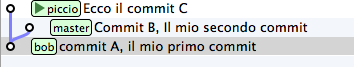

L'eliminazine di una variabile è ugualmente banale:

>git branch -d teddy 
>git branch -d piccio

Avrai notato che di default git crea alcune di queste variabili. Per esempio, nelle figure sopra appariva anche la variabile `master`, puntata su `B`.

L'etichetta `master` ti permette di andare sul quel `commit` scrivendo:

> git checkout master

Ora attento, perché siamo di nuovo in una di quelle occasioni dove la conoscenza di SVN fornisce solo dei grattacapi: queste etichette in git si chiamano `branch`. Ripetiti mille volte: un `branch` in git non è un ramo, è un'etichetta, un puntatore ad un `commit`, una variabile che contiene la chiave di un `commit`. Tanti comportamenti di git che appaiono assurdi e complicati diventano molto semplici se eviti di pensare ai `branch` di git come ad un equivalente dei branch di SVN.

Dovrebbe iniziare a risultarti chiaro perché molti dicano che "*i branch su git sono molto economici*": per forza! Sono delle semplicissime variabili!

Divertiti ad aggiungerne altre

>git branch dev

Voilà: hai aggiunto un `branch`.

Nota un'altra cosa: vedi che accanto a `master` SmartGit aggiunge un segnaposto triangolare verde? Quel simbolo indica che in questo momento sei *agganciato* al `branch` `master`, perché il tuo ultimo comando di spostamento è stato `git checkout master`.

Potresti spostarti su `dev` con

>git checkout dev

Il segnaposto si è spostato su `dev`.

Di default git aggiunge sempre anche un'altra variabile: il puntatore `HEAD`, che punta sempre all'elemento del `repository` sul quale ti trovi. Sostanzialmente, il segnaposto visualizzato da SmartGit indica la posizione di HEAD. Altri editor grafici utilizzano differenti rappresentazioni. `gitk`, per esempio, visualizza in grassetto il `branch` sul quale ti trovi. 
Per sapere su quale `branch` ti trovi, dalla linea di comando, ti basta eseguire

>git branch 
>* dev 
>  master 

L'asterisco suggerisce che `HEAD` adesso stia puntanto a `dev`.

Non dovresti essere troppo sorpreso nel verificare che, nonostante tu abbia cambiato `branch` da `master` a `dev` il tuo `file system` non sia cambiato di una virgola: in effetti, sia `dev` che `master` stanno puntando allo stesso identico `commit`.

Non di meno, ti domanderai probabilmente a cosa mai possa servire passare da un `branch` all'altro, se non sortisce alcun effetto sul progetto.

Il fatto è che quando esegui il `checkout` di un `branch`, in qualche modo ti *agganci* all'etichetta; l'etichetta del `branch`, in altre parole, inizierà a seguirti, `commit` dopo `commit`.

Guarda: adesso sei su `dev`. Apporta una modifica qualsiasi e committa

>touch style.css 
>git add style.css 
>git commit -m "Adesso ho anche il css" 

Visto cosa è successo? L'etichetta `dev` si è spostata in avanti e si è agganciata al tuo nuovo `commit`.

Ti domanderai anche perché mai git chiami quelle etichette `branch`. Il motivo è che, anche se le linee di sviluppo che divergono in git non sono `branch`, i `branch` vengono normalmente usati proprio per dar loro un nome.

Guardalo nel concreto. Torna a `master` ed apporta qualche modifica.

>git checkout master 
>touch angular.js 
>git add angular.js 
>git commit -m "angular.js rocks" 

Come c'era da aspettarselo, l'etichetta `master` è avanzata di un posto, per puntare al tuo nuovo `commit`.

Adesso c'è una certa equivalenza tra le linee di sviluppo e i `branch`. Nonostante questo, ti conviene sempre tenere mentalmente separati i due concetti, perché ti faciliterà molto la gestione della storia del tuo progetto

Per esempio: non c'è dubbio che il `commit` col commento "*angular.js rocks*" sia contenuto nel `branch master`, giusto? 
Che dire però di `A` e di `B`? A quale `branch` appartengono?

Occhio, perché questo è un altro dei concetti che procurano dei mal di testa agli utenti di SVN, e perfino a quelli di Mercurial. 

In effetti, per rispondere a questo interrogativo gli utenti di git si pongono una domanda differente: 

"*il `commit A` è raggiungibile da `master`?*"

Cioè: percorrendo a ritroso la storia dei `commit` partendo da `master`, si passa da `A`? 
Se la risposta è *sì* si può afferamere che `master` contenga le modifiche introdotte da `A`.

Una cosa che i fan di Mercurial e di SVN potrebbero trovare disorientante è che, siccome il `commit A` è raggiungibile anche da `dev`, appartiene *sia* a `master` che a `dev`.

Pensaci su. Se tratti i `branch` come puntatori a `commit` dovrebbe sembrarti tutto molto lineare.

# Obiettivo 4: fare i giocolieri con i `commit`

Come hai visto, git riesce a conservare la storia delle modifiche dei file senza mai salvarne le differenze. 
All'inizio della guida ti avevo anticipato il comportamento diametralmente opposto di SVN e di git, su questo punto:

* SVN memorizza le diff e, all'occorrenza, ricostruisce lo stato attuale;
* git memorizza lo stato attuale e, all'occorrenza, calcola le diff.

Per cui, quando nel `repository` fai riferimento al `commit` `dev`, intendi "*l'intero progetto, così come è stato fotografato al momento di quel commit*".

Se la stessa situazione fosse su SVN diresti che il commit `dev` "*contiene tutte le modifiche apportate ai file, partendo dal commit immediatamente precedente*".  

Per git, calcolare le modifiche apportate ai file da un `commit` all'altro non è poi difficile. Per esempio, puoi ricavarle con

> git diff dev master

Con `git diff FROM TO` chiedi a git "*qual è l'elenco delle modifiche ai file che devo applicare a `FROM` perché il progetto diventi identico a quello di `TO`*"? 

Con un po' di immaginazione puoi pensare che le linee tra i commit rappresentino le modifiche che tu hai apportato ai file e alle directory per ottenere un `commit`. 
Per esempio, qui in rosso ho evidenziato la linea che rappresenta quel che hai fatto quando sei partito da `B` e hai creato il commit `dev`.

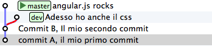

Se rammenti, avevi fatto 

>touch style.css 
>git add style.css 
>git commit -m "Adesso ho anche il css" 

Quindi, potresti dire che quella linea rossa rappresenti l'aggiunta del file `style.css`.

Bene. Tieni a mente questo modello. Adesso ti mostrerò uno dei comandi più folli e versatili di git: `cherry-pick`.

`cherry-pick` applica i cambiamenti introdotti da un commit sopra un altro commit.

Vediamolo subito con un esempio.

> git checkout dev 
> git checkout -b experiment&nbsp;&nbsp;&nbsp;# esegue sia branch che checkout 
> touch experiment 
> git add experiment 
> git commit -m "un commit con un esperimento" 

Ci interesserebbe applicare l'esperimento anche al ramo `master`

> git checkout master 
> git cherry-pick experiment

git ha applicato il cambiamento introdotto dal commit `dev` (la linea evidenziata in rosso xxx) al commit `master`, e poi ha fatto un `commit`. `cherry-pick` "coglie" il `commit` che gli indichi e lo applica sul `commit` dove ti trovi.

Se guardi sul `file system`, infatti, ti accorgi che git ha aggiunto il file `style.css` xxxx

Inizi a intuire le giocolerie che potrai fare con questo strumento? 
Voglio darti qualche spunto.

### Correggere un bug a metà di un ramo

Proviamo a creare una linea di sviluppo con 3 `commit`

> git checkout -b feature&nbsp;&nbsp;&nbsp;&nbsp;&nbsp;&nbsp;&nbsp;&nbsp;# scorciatoria per fare branch + checkout 
> touch feature 
> git add feature 
> git commit -m "feature" 
> 
> touch orribile-baco 
> git add orribile-baco 
> git commit -m "orrore e raccapriccio" 
> 
> touch altra-feature 
> git add altra-feature 
> git commit -m "altra feature" 

Oh, no! il secondo `commit` è stato un errore madornale!  Ah, se solo si potesse riscrivere la storia ed evitarlo!

L'idea è di tornare indietro nel tempo, su `master`, ed usare `cherry-pick` per riapplicarvi le modifiche, avendo cura però di non applicare le modifiche introdotte da `orrore e raccapriccio`. Questo è uno dei casi in cui ti sarà necessario conoscere i valori delle chiavi:

>git log master..feature --oneline 
>**8f41bb8** altra feature 
>**ec0e615** orrore e raccapriccio 
>**b5041f3** feature 

Inizia a tonare indietro nel tempo. Riposizionati su `master`

>git checkout master 

e sposta il `feature` indietro, nella posizione dove lo avevi creato prima di fare i `commit`

>git branch --force feature 

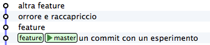

Non ti resta che prenderti, con `cherry-pick` i soli `commit` che ti interessano

>git checkout feature 
>git cherry-pick b5041f3&nbsp;&nbsp;&nbsp;# prendo "feature"

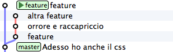

>git cherry-pick 8f41bb8&nbsp;&nbsp;&nbsp;# prendo "altra feature"

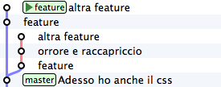

Et voilà. Hai ricostruiro il ramo di sviluppo saltando il `commit` sbagliato. Resta un ramo orfano, cioè, senza alcun `branch`: verrà cancellato prima o poi dal garbage collector di git. I rami orfani di solito non vengono mostrati dagli editor grafici per cui, a cose normali, dovresti vedere questa situazione:

Partivi da 

e finisci con

Urca! L'impressione è che git abbia riscritto la storia eliminando un `commit` a metà di un ramo, vero? 
 
Infatti, molti raccontano che git sia capace di riscrivere la storia e che questo suo comportamento sia estremamente pericoloso. Ecco: tu hai visto che non è così; git è estremamente conservativo e quando ti permette di manipolare i `commit` non fa altro che agire *in append*, costruendo *nuovi* rami. 

### Spostare un ramo di sviluppo

Voglio farti vedere un'altra magia del `cherry-pick`, per dissipare il velo di mistero di cui è inspiegabilmente circondato il comando `rebase`.

Riprendi il tuo `repository`. Mettiamo che ti vada di proseguire a sviluppare i tuoi css, per cui farai un nuovo commit su `dev`

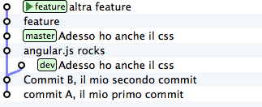

>git checkout dev 
>echo "a { color:red; }" >> style.css 
>git commit -am "i link sono rossi"
>&nbsp;&nbsp;&nbsp;# commit -am è uno shortcut per git add + commit

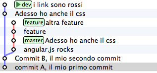

Ottimo. I tuoi css sono perfetti. Peccato che il ramo `dev` sia rimasto un po' indietro rispetto a `master`. Del resto, cosa potevi farci? `master` è andato avanti e `dev` è rimasto lì dove lo avevi creato.

Certo, se si potesse spostare il ramo `dev` *sopra* `master`…

Non ti torna in mente `cherry-pick`? È un caso come quello precedente: solo che invece di viaggiare nel passato devi avere un po' di fantasia e immaginare di viaggiare nel futuro. Devi riportare i `commit` di `dev` (scritti nel passato) sull'ultimo commit di `master`, che relativamente a `dev` è il futuro.

Cioè: riscrivi la storia facendo come se i commit di `dev` siano stati scritti *dopo* i `commit` di `master`. 

Ok. Si tratta di spostare 2 `commit`. A colpi di `cherry-pick` sposterai i due commit del ramo blue sopra `master`.

Il risultato sarà questo:

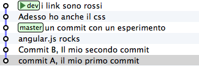

Confrontalo con la situazione di partenza

Vedi cosa è successo? Il ramo `dev`, è stato staccato ed è stato impiantato sopra master.

Uno shortcut per evitare di spostare un `commit` alla volta da un ramo all'altro è il comando `git-rebase`.

Provalo. Sul tuo `repository`

esegui

> git rebase master

dice a git: "*sposta il ramo corrente sulla nuova base: *`master`". 
Sotto sotto, git non fa altro che eseguire una serie di `cherry-pick`: prende tutti i `commit` di `dev` che `master` ancora non ha e ce li applica in ordine.

Il risultato sarà

Vedi? È del tutto equivalente a spostare uno per uno i `commit` con `cherry-pick`.

Riesci ad immaginare a cosa potrebbe servire un tool simile? 
Guarda, provo a descriverti una situazione molto comune.

Stacchi un ramo da `dev` e inizi a lavorarci

>git checkout -b sviluppo 
>touch file1 && git add file1 && git commit -m "avanzamento 1" 
>touch file2 && git add file2 && git commit -m "avanzamento 2" 
>touch file3 && git add file3 && git commit -m "avanzamento 3" 

Peccato che, come accade nel mondo reale, i tuoi colleghi nel frattempo abbiano fatto avanzare il ramo `dev` con i loro `commit`

>git checkout dev 
>touch dev1 && git add dev1 && git commit -m "developer 1" 
>touch dev2 && git add dev2 && git commit -m "developer 2" 

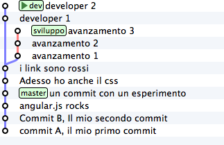

Riconosci questa situazione? È sostanzialmente inevitabile, a causa della natura fortemente non lineare del processo di sviluppo 
`rebase` ti permette di renderla nuovamente lineare. Con

>git checkout sviluppo 
>git rebase dev

chiedi a git "*riapplica tutto il lavoro che ho fatto nel mio ramo come se lo avessi staccato dall'ultimo commit di sviluppo, ma non costringermi a spostare i commit uno per uno con cherry-pick*"

Il risulato è

Vedi? Gli ultimi 3 `commit` introducono le stesse identiche modifiche che avevi apportato tu nel tuo ramo, ma tutto appare come se tu avessi staccato il ramo dall'ultima versione di `dev`.

## Obiettivo 5: unire due rami

Confronta le ultime due immagini. 

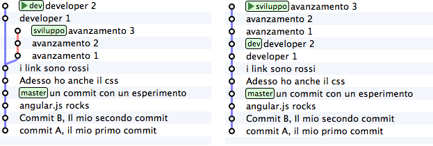

Nella prima si vede chiaramente come `sviluppo` non contenga i due contributi `developer 1` e `developer 2` dei tuoi colleghi. Quei due `commit` non sono *raggiungibili* dal tuo ramo. Cioè: percorrendo a ritroso la storia a partire dal tuo ramo `sviluppo` non incontrerai quei due `commit`.

Guarda adesso la seconda immagina, cioè la storia che hai ottenuto dopo il `rebase`: adesso i due `commit` sono *raggiungibili* da `sviluppo`. Beh, avevi fatto `rebase` appositamente per allinearti con il lavoro dei tuoi colleghi quindi, giustamente, git ha fatto in modo che il tuo ramo contenesse anche i loro contributi.

`rebase` e `cherry-pick` non sono i soli strumenti con i quali puoi *integrare* nel tuo ramo il contenuto di altri rami. Anzi: uno degli strumenti che utilizzerai più spesso è `merge`

`merge` funziona come te lo aspetti. Ci sono solo 3 particolarità sulle quali credo valga la pena di soffermarsi. La prima è che il `merge` di git funziona spaventosamente bene. Merito del modello di storage di git: durante i merge git non deve stare ad impazzire, come SVN, per capire se una diff sia già stata applicata o no, perché parte dal confronto di fotografie del progetto. Ma non entriamo nel dettaglio: goditi la potenza di `git merge` e dimentica tutte le difficoltà che hai sempre incontrato con SVN.

Le altre due particolarità sono il `fast-forward` e l'`octopus merge`.

Ma preferisco mostrarteli subito con degli esempi

Stacca un ramo da `dev` e aggiungi un paio di `commit`

>git checkout -b bugfix dev

Nota: qui ho usato una forma super concisa equivalente ai comandi:

> git checkout dev 
> git branch bugfix 
> git checkout bugfix  

Prosegui aggiungendo i due `commit`

>touch fix1 && git add fix1 && git commit -m "bugfixing  1" 
>touch fix2 && git add fix2 && git commit -m "bugfixing  2" 

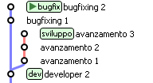

Dopo di che, annunci ai tuoi colleghi di aver completato il bugfixing e inviti tutti a integrare il tuo lavoro nel loro.

Per integrare il bugfix in `sviluppo` un tuo collega potrebbe fare

>git checkout sviluppo 
>git merge bugfix

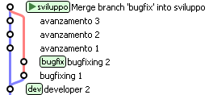

Semplice, non trovi? 
Con `git merge bugfix` hai chiesto a git: "*procurami un `commit` che contenga tutto quello che c'è nel mio `branch` corrente e aggiungici tutte le modifiche introdotte dal ramo `bugfix`*".

Prima di eseguire il merge, git guarda nel suo `blob storage` e cerca se per caso esista già un `commit` contenente entrambi i rami. Dal momento che non lo trova, git lo crea, fonde i due file system e poi assegna come genitori del nuovo `commit` entrambi i `commit` di provenienza. 
In effetti, il risultato è un nuovo `commit` che ha due genitori. Nota anche che l'etichetta del tuo ramo, `sviluppo` si è spostata sul nuovo `commit`. Non dovrebbe essere una sopresa: il `branch` corrente è pensato per seguirti, `commit` dopo `commit`.

### `fast-forward`

Se ti torna questo ragionamento, non avrai difficoltà a capire il `fast-forward`. Mettiti alla prova e vediamo. Prova a rispondere a questa domanda: cosa accadrebbe se ti spostassi sul ramo `dev` e chiedessi un `merge` col ramo `sviluppo` con `git merge sviluppo`?

Per risponderti, ripeti il ragionamento sopra: stai chiedendo a git "*procurami un `commit` che contenga sia il mio ramo corrente `dev` che il ramo `sviluppo`*". git consulterebbe i `commit` nel suo database per asicurarsi che un `commit` con queste caratteristiche sia già presente.

E lo troverebbe! 
Guarda il `commit` puntato proprio dal ramo `sviluppo`: senza dubbio contiene `sviluppo` (per definizione!); e, siccome percorrendo la storia verso il basso da `sviluppo` è possibile raggiungere `dev`, non c'è nemmeno dubbio che `sviluppo` contenga già le modifiche introdotte da `dev`. 
Ti torna?

Quindi, git non ha motivo per creare un nuovo `commit` e si limiterà a spostarvi sopra la tua etichetta corrente.

Prova:

>git checkout dev 
>git merge sviluppo

 

Prova a confrontare la storia prima e dopo il merge

Vedi cosa è accaduto? Che l'etichetta `dev` è stata *spinta in avanti*.

Ecco: hai visto un caso di `fast-forward`. Tieni a mente questo comportamento: di tanto in tanto capita di averne a che fare, soprattutto quando vuoi evitare che avvenga. Per esempio: il `merge` che hai appena fatto, e che è risultato in un `fast-forward`, ha creato una storia nella quale risulta un po' difficile capire *quando* il ramo `dev` sia stato staccato. Non si vede nemmeno bene quando il `merge` sia stato effettuato, perché manca un `commit` con un commento tipo `merge branch 'dev' into sviluppo`.

### `octopus merge`

E per chiudere l'argomento `merge` vediamo l'`octopus merge`. Ma ci vorranno pochi secondi, perché è una cosa di una semplicità sconcertante.

Guarda un `commit` nato da un `merge`: non è diverso dagli altri `commit` se non per il fatto di avere due genitori invece di uno solo.

Ecco: su git un `commit` può avere un numero arbitrario di genitori. In altre parole, puoi mergiare tra loro più `branch` in un colpo solo.

Guarda

>git branch uno 
>git branch due 
>git branch tre 
>git branch quattro 
>git checkout uno && touch uno && git add uno && git commit -m "uno" 
>git checkout due && touch due && git add due&& git commit -m "due" 
>git checkout tre && touch tre&& git add tre && git commit -m "tre" 
>git checkout quattro && touch quattro && git add quattro && git commit -m "e quattro" 

Bene. Hai 4 rami. Chiedi a dev di mergiarli tutti, in un colpo solo

>git checkout dev 
>git merge uno due tre quattro 

Et voilà! Un `merge` di 4 `branch`

* fast-forward
* p2p
* fetch
* push
