Introduzione
============

Questa guida è un po' diversa dalle altre.

Molti dei testi che ho letto su git si preoccupano di introdurti ai comandi base e lasciano ai capitoli più avanzati la descrizione del modello di funzionamento interno, oppure la saltano del tutto.

Quello che ho notato, però, è che imparando git partendo dai comandi base rischi di finire per usarlo come uno strumento vagamente simile a SVN ma provvisto di un set aggiuntivo di comandi esoterici, il cui funzionamento ti resterà sostanzialmente oscuro.

Facci caso: alcuni di quelli che hanno imparato git abbastanza da riuscire ad usarlo quotidianamente ti racconteranno di aver fatto molta fatica a capire cosa sia un `rebase` o di non cogliere esattamente che uso fare dell'`index`. 

La mia impressione è che, una volta capito il modello interno (che è sorprendentemente semplice!), tutto git appaia improvvisamente lineare e coerente: non c'è davvero alcun motivo per cui il `rebase` dovrebbe essere un argomento misterioso.

Questa guida prova a spiegarti git seguendo un percorso contrario a quello adottato di solito: partirai dalla spiegazione degli internal e finirai per imparare, nello stesso momento, sia comandi base che quelli avanzati, in poco tempo e senza troppi grattacapi.

Non imparerai, però, tutti i comandi. Piuttosto che mostrarti tutte le opzioni disponibili, questa guida punterà a farti comprendere i concetti e il modello sottostante e a darti gli strumenti per essere autonomo quando vorrai approfondire un argomento sulle man page o vorrai fare qualcosa di fuori dall'ordinario con il tuo `repository`.

Un'ultima nota: questa guida è organizzata come un lungo tutorial. Se ti armi di terminale ed esegui ognuno dei comandi, tipograficamente riportati così

>ls

potrai riprodurre esattamente sul tuo computer ognuno degli esempi della guida.

# Non sono parente di SVN

Per chi arrivi da SVN, git presenta una sola difficoltà: ha molti comandi identici. Ma è una somiglianza superficiale e ingannevole: sotto il cofano git è totalmente differente.

Per questo ti suggerisco di rifuggire sempre dalla tentazione di fare dei paralleli con SVN, perché sarebbero solo fuorvianti. Troverai comandi come `add`, `checkout`, `commit` e `branch` che ti sembrerà di conoscere. Ecco: fai *tabula rasa* di quel che conosci, perché in git quei comandi significano cose molto molto differenti.

Tentare di capire git usando SVN come modello, a volte, porta semplicemente fuori strada. 
Per esempio: ci crederesti che questo repository ha 3 branch?

Sì: 3 branch, non 2.

Oppure: ci crederesti che git, più che un sistema di versionamento del codice, potrebbe essere meglio descritto come un "*sistema peer-to-peer di database chiave/valore su file system*"?

Per cui: dimentica quello che sai sui branch e sui changeset di SVN, e preparati a concetti completamente nuovi.

Sono persuaso che li troverai molto più omogenei e potenti di quelli di SVN. Devi solo predisporti ad un piccolo salto culturale.

## Setup

Installa [git](http://git-scm.com/downloads).

Poi configuralo perché ti riconosca

> git config --global user.name "Arialdo Martini" 
> git config --global user.emal arialdomartini@gmail.com`

Se sei su Windows puoi eseguire quei comandi in `git bash`, un terminale predisposto a `git`. Su Linux e Mac OS X puoi usare il tuo terminal preferito.

Se vuoi, installa anche un client grafico. Io ti suggerisco [SmartGit](http://www.syntevo.com/smartgithg/), che è gratuito per progetti OpenSource. Altrimenti appoggiati al tool `gitx` che trovi in bundle insieme all'installazione di git.

Fantastico. Partiamo.

Gli internal di git
===================

# 3 differenze principali

Iniziamo con tre caratteristiche di git con le quali dovresti familiarizzare.

1. **Non c'è un server**: il repository è locale. La gran parte delle operazioni è locale e non richiede l'accesso alla rete. Anche per questo troverai git  incredibilmente veloce.
2. **Il progetto è indivisibile**: git lavora sempre con l'intero codice sorgente del progetto e non su singole directory o su singoli file; con git non c'è differenza tra committare nella directory principale o in una sotto-directory. Non esiste il concetto di `checkout` di un singolo file o di una singola directory. Per git il progetto è l'unità indivisibile di lavoro.
3. **git non memorizza i cambiamenti dei file**: git salva sempre i file nella loro interezza. Se in un file di 2 mega modificassi un singolo carattere, git memorizzerebbe per intero la nuova versione del file. Questa è una differenza importante: SVN memorizza le differenze e, all'occorrenza, ricostruisce il file; git memorizza il file e, all'occorrenza, ricostruisce le differenze.

## 4 livelli di nerdosità

Sull'assenza di un server ho un po' mentito: come ti ho già detto e come vedrai più avanti, git è un sistema peer-to-peer, e riesce ad interagire con dei server remoti.
Nonostante questo resta sostanzialmente un sistema locale.

Per capire quanto questo possa avvantaggiarti, prova a vederla così: quando il codice sorgente di un progetto è ospitato su un computer remoto hai 4 modi per editare il codice

1. Lasci tutto il codice sul computer remoto e vi **accedi con ssh per editare un singolo file**
2. Trovi il modo di ottenere **una copia del singolo file** per poterci lavorare più comodamente in locale e lasci tutto il resto sul computer remoto
3. Trovi il modo di ottenere **una copia locale di un intero albero del file system** e lasci il resto della storia dei commit sul computer remoto
4. Ottenieni una **copia locale dell'intero repository** con tutta la storia del progetto e lavori in locale

Avrai notato due cose.

La prima, che SVN e i sistemi di versionamento ai quali sei probabilmente abituato operano al livello 3.

La seconda, che i 4 sistemi sono elencati in ordine di comodità: in linea di massima, quando il materiale è conservato sul sistema remoto il tuo lavoro è più macchinoso, lento e scomodo. SVN ti permette di fare il checkout di un'intera directory proprio perché così ti risulti più comodo passare da un file all'altro senza dover continuamente interagire col server remoto.

Ecco: git è ancora più estremo; preferisce farti avere a disposizione tutto sul tuo computer locale; non solo il singolo checkout, ma l'intera storia del progetto, dal primo all'ultimo commit.

In effetti, qualunque cosa tu voglia fare, git chiede normalmente di ottenere una copia completa di quel che è presente sul server remoto. Ma non preoccuparti troppo: git è più veloce a ottenere l'intera storia del progetto di quanto SVN lo sia ad ottenere un singolo checkout.

## Il modello di storage

Passiamo dalla terza differenza. E preparati a conoscere il vero motivo per cui git sta sostituendo molto velocemente SVN come nuovo standard *de-facto*.

* SVN memorizza la collezione dei vari delta (o patch) applicati nel tempo ai file; all'occorrenza ricostruisce lo stato attuale;
* git memorizza i file così come sono, nella loro interezza; all'occorrenza ne calcola i delta.

Se vuoi evitare tanti grattacapi con git, il miglior suggerimento che tu possa seguire è di trattarlo come un **database chiave/valore**. 

Passa al terminal e guarda nel concreto.

Mettiti nella condizione di avere 2 file vuoti sul file system: 

> mkdir progetto 
> cd progetto 
> mkdir libs 
> touch libs/foo.txt 
> mkdir templates 
> touch templates/bar.txt 

    /
    ├──libs
    |     └──foo.txt
    |
    ├──templates
            └──bar.txt

Decidiamo di gestire il progetto con git

> git init

Aggiungi il primo file a git

> git add libs/foo.txt

Con questo comando, git ispeziona il contenuto del file (è vuoto!) e lo memorizza nel suo database chiave/valore, chiamato `blob storage` e conservato su file system nella directory nascosta `.git`. 

Siccome il `blob-storage` è un database chiave valore, git cercherà di calcolare una chiave ed un valore per il file che hai aggiunto. Per il valore git userà il contenuto stesso del file; per la chiave, calcolerà lo sha1 del contenuto (se sei curioso, nel caso di un file vuoto vale `e69de29bb2d1d6434b8b29ae775ad8c2e48c5391`)

Per cui, nel `blob storage` git salverà un oggetto `blob`, univocamente identificabile dalla sua chiave (che, in assenza di ambiguità, vale la pena di abbreviare)

Adesso aggiungi il secondo file

> git add templates/bar.txt

Ora, siccome `libs/foo.txt` e `templates/bar.txt` hanno lo stesso identico contenuto (sono entrambi vuoti!), nel `blob storage` entrambi verranno conservati in un unico oggetto:

Come vedi, nel `blob storage` git ha memorizzato solo il contenuto del file, non il suo nome né la sua posizione.

Naturalmente, però, a noi il nome dei file e la loro posizione interessano eccome.
Per questo, nel `blob storage`, git memorizza anche altri oggetti, chiamati `tree` che servono proprio a memorizzare il contenuto delle varie directory e i nomi dei file.

Nel nostro caso, avremo 3 `tree` 

Come ogni altro oggetto, anche i `tree` sono memorizzati come chiave/valore.

Tutte queste strutture vengono raccolte dentro un contenitore, chiamato `commit`.

 

Come avrai intuito, un `commit` non è altro che un elemento del database chiave/valore, la cui chiave è uno SHA1, come per tutti gli altri oggetti, e il cui valore è un puntatore al `tree` del progetto, cioè la sua chiave (più un altro po' di informazioni, come la data di creazione, il commento e l'autore). 
Non è troppo complicato, dopo tutto, no?

Quindi, il `commit` è l'attuale fotografia del file system.

Adesso fai

> git commit -m "commit A, il mio primo commit"

Stai dicendo a git: 

*memorizza nel repository, cioè nella storia del progetto, il commit che ti ho preparato a colpi di add*

Il tuo `repository`, visto da SmartGit, adesso ha questo aspetto

La riga col pallino che vedi sulla sinistra rappresenta l'oggetto `commit`. Nel pannello sulla destra, invece, puoi vedere la chiave del `commit`.

In generale, a meno che non si debba parlare proprio del modello interno come stiamo facendo adesso, non c'è una grande necessità di rappresentare tutta la struttura di `blob` e `tree` che costituisce un `commit`. Difatti, dopo il prossimo paragrafo inizieremo a rappresentare i `commit` come nella figura qui sopra: con un semplice pallino.

Già da adesso, comunque, dovrebbe risultarti più chiaro il fatto che dentro un `commit` ci sia l'intera fotografia del progetto e che, di fatto, un `commit` sia l'unità minima ed indivisibile di lavoro.

# L' `index` o `staging area` 

Sostanzialmente, non c'è molto altro che tu debba sapere del modello di storage di git. Ma prima di passare a vedere i vari comandi, vorrei introdurti ad un altro meccanismo interno: la `staging area` o `index`. L'`index` risulta sempre misterioso a chi arrivi da SVN: vale la pena parlarne perché quando saprai come funzionano il `blob storage` e l'`index`, git non ti sembrerà più contorto e incomprensibile; piuttosto, ne coglierai la coerenza e lo troverai estremamente prevedibile.

L'`index` è una struttura che fa da cuscinetto tra il file system e il repository. È un piccolo buffer che puoi utilizzare per costruire il prossimo `commit`. 

Non è troppo complicato:

 * il `file system` è la directory con i tuoi file.
 * il `repository` è il database locale su file, che conserva i vari `commit`
 * l'`index` è lo spazio che git ti mette a disposizione per creare il tuo prossimo `commit` prima di registrarlo definitivamente.

Fisicamente, l'`index` non è molto diverso dal `repository`: entrambi conservano i dati nel `blob storage`, usando le strutture che hai visto prima.

In questo momento, appena dopo aver completato il tuo primo `commit`, l'`index` conserva una copia del tuo ultimo `commit` e si aspetta che tu lo modifichi.

Sul file system hai

    /
    ├──libs
    |     └──foo.txt
    |
    ├──templates
            └──bar.txt

Proviamo a fare delle modifiche al file `foo.txt`

>  echo "nel mezzo del cammin" >> libs/foo.txt 

e aggiorna l'`index` con

> git add libs/foo.txt

All'esecuzione di `git add` git ripete quel che aveva già fatto prima: analizza il contenuto di `libs/foo.txt`, vede che c'è un contenuto che non ha mai registrato e quindi aggiunge al `blob storage` un nuovo `blob` col nuovo contenuto del file; contestualmente, aggiorna il `tree` `libs` perché il puntatore chiamato `foo.txt` indirizzi il suo nuovo contenuto

Prosegui aggiungendo un nuovo file `doh.html` alla root del progetto

>  echo "happy happy joy joy" > doh.html 
>  git add doh.html

Come prima: git aggiunge un nuovo `blob` object col contenuto del file e, contestualmente, aggiunge nel `tree` "/" un nuovo puntatore chiamato `doh.html` che punta al nuovo `blob` object

Il contenitore di tutta questa struttura è sempre un oggetto `commit`; git lo tiene parcheggiato nella `staging area` in attesa che tu lo spedisca al `repository`.
Questa struttura rappresenta esattamente la nuova situazione sul file system: è nuovamente una fotografia dell'intero progetto, ed include anche il file `bar.txt`, nonostante tu non lo abbia modificato. Per inciso: non dovresti preoccuparti per il consumo di spazio perché, come vedi, per memorizzare `bar.txt` git sta riutilizzando l'oggetto `blob` creato nel `commit` precedente, per evitare duplicazioni.

Bene. Abbiamo quindi una nuova fotografia del progetto. 
A noi interessa, però, che git conservi anche la storia del nostro file system, per cui ci sarà bisogno di memorizzare da qualche parte il fatto che questa nuova situazione (lo stato attuale dell'`index`) sia figlia della precedente situazione (il precedente `commit`).

In effetti, git aggiunge automaticamente al `commit` parcheggiato nella `staging area` un puntatore al `commit` di provenienza

La freccia rappresenta il fatto che l'`index` è figlio del `commit A`. È un semplice puntatore. Nessuna sopresa, se ci pensi; git, dopo tutto, utilizza il solito, medesimo, semplicissimo modello ovunque: un database chiave/valore per conservare il dato, e una chiave come puntatore tra un elemento e l'altro.

Ok. Adesso committa

>  git commit -m "Commit B, Il mio secondo commit"

Con l'operazione di commit si dice a git "*Ok, prendi l'attuale `index` e fallo diventare il tuo nuovo `commit`. Poi restituiscimi l'`index` così che possa fare una nuova modifica*"

Dopo il `commit` nel database di git avrai

Una breve osservazione: spesso le interfacce grafiche di git omettono di visualizzare l'`index`. `gitk`, per esempio, la visualizza solo se ci sono modifiche da committare. Il tuo repository in `gitk` adesso viene visualizzato così

Guarda tu stesso. Lancia

>  gitk

Ricapitolando:

1. git memorizza sempre i file nella loro interezza
2. il `commit` è uno dei tanti oggetti conservati dentro il database chiave/valore di git. È un contenitore di tanti puntatori ad altri oggetti del database: i `tree` che rappresentano directory con nomi di file che a loro volta puntano ad altri `tree` (sottodirectory) o a dei `blob` (il contenuto dei file)
3. ogni oggetto `commit` ha un puntatore al `commit` padre da cui deriva
4. l'`index` è uno spazio di appoggio nel quale puoi costruire, a colpi di `git add`, il nuovo `commit` 
5. con `git add` aggiungi un file all'`index`; con `git commit` registri l'attuale `index` facendolo diventare il nuovo `commit`.    

Bene: adesso hai tutta la teoria per capire i concetti più astrusi di git come il `rebase`, il `cherrypick`, l'`octopus-merge`, l'`interactive rebase`, il `revert` e il `reset`.

Passiamo al pratico.

I comandi di git
================

# Obiettivo 1: tornare indietro nel tempo

Dunque, se in git tutto è conservato in un database chiave/valore, probabilmente ci sarà modo per referenziare un qualunque oggetto del database usando la sua chiave.

In effetti è proprio così. 

Adesso proviamo a tornare indietro nel tempo, al `commit A`, utilizzando il comando `git checkout`.

Il comando `checkout` prende il `commit` indicato e lo copia nel `file system` e nella `staging area`.

Già: ma qual è la chiave del `commit A`?
Lo puoi scoprire con un client grafico o col comando `git log` che mostra tutto quello che hai fatto fin'ora

> **git log --oneline** 
>2a17c43 Commit B, Il mio secondo commit 
>56674fb commit A, il mio primo commit 

Attenzione! Siccome nel `commit` vengono memorizzati anche la data e l'autore, le tue chiavi risulteranno diverse dalle mie.

Sul mio `repository` la chiave del `commit A` è `56674fb`. 
Bene: torniamo indietro al passato, al momento del `commit` `A`

> **ls** 
> doh.html&nbsp;&nbsp;&nbsp;&nbsp;libs&nbsp;&nbsp;&nbsp;&nbsp;templates 
> **git checkout 56674fb** 
> ls 
> libs&nbsp;&nbsp;&nbsp;&nbsp;templates 

Effettivamente, a parte un misterioso e prolisso messaggio di con cui git si lamenta di essere in `'detached HEAD' state` (poi chiariremo questo punto), il file system è tornato allo stato del primo commit e, infatti, il file `doh.html` è scomparso.

#Obiettivo 2: divergere

Usando una convenzione grafica molto comune nella letteratura su git, potremmo rappresentare la situazione attuale del tuo repository con

> **A**---B

Cioè: ci sono due `commit`, `A` e `B`. Il `commit B` è figlio di `A` (il tempo scorre verso destra). Il `commit` in grassetto indica il punto in cui ti trovi attualmente.

Che succederebbe se adesso facessi qualche modifica e committassi? 
Accadrebbe che il nuovo `commit C` che andresti a generare sarebbe figlio di `A` (perché è da lì che parti), ma la linea di svilupppo proseguirebbe divergendo dalla linea `A---B`.

Cioè, si creerebbe questa situazione

>  A---B 
>  &nbsp;&nbsp;\  
>  &nbsp;&nbsp;&nbsp;**C**

Provalo davvero:

>  echo "ei fu siccome immobile" > README.md 
>  git add README.md 
>  git commit -m "Ecco il commit C" 

Hai ottenuto una diramazione, senza ricorrere al meccanismo di copia dei file utilizzato da SVN al momento deella creazione di un branch: il modello a chiave/valore e puntatori di git rende molto economico rappresentare una linea di sviluppo che diverge.

Due osservazioni importanti.
 
La prima per ribadire il concetto che git non ha mai memorizzato i delta tra i file: `A`, `B` e `C` sono snapshot dell'intero progetto. È molto importante ricordarselo, perché ti aiuterà a capire che tutte le considerazioni che sei sempre stato abituato a fare con SVN in git potrebbero non valere.

La seconda potrebbe un po' sorprenderti: le due linee di sviluppo divergenti che hai appena visto non sono `branch`. In git i rami sono dei puntatori dotati di nome, o delle etichette. Te ne parlerò nel prossimo paragrafo, ma abituati già a ripeterti: in git i `branch` non sono rami di sviluppo.

# Obiettivo 3: creare un branch

Con il comando `checkout` hai imparato a spostarti da un `commit` all'altro

Tutto quello di cui hai bisogno è la chiave del `commit` sul quale vuoi atterrare
>**git log --oneline --all** 
>deaddd3 Ecco il commit C 
>2a17c43 Commit B, Il mio secondo commit 
>56674fb commit A, il mio primo commit 

>**git checkout 56674fb**&nbsp;&nbsp;&nbsp;&nbsp;&nbsp;# vai al `commit A` 
>**git checkout 2a17c43**&nbsp;&nbsp;&nbsp;&nbsp;# vai al `commit B` 
>**git checkout deaddd3**&nbsp;&nbsp;&nbsp;# vai al `commit C` 

Però, bisogna ammetterlo: gestire i `commit` `A`, `B` e `C` dovendoli chiamare `56674fb`, `2a17c43` e `deaddd3` è di una scomodità unica.

git risolve il problema facendo quel che farebbe ogni programmatore di buon senso: dal momento che quei numeri sono dei puntatori ad oggetti, git permette di usare delle variabili per conservarne il valore. Assegnare un valore ad una variabile è semplice:

>**git branch bob 56674fb**

Vedi l'etichetta `bob` proprio in corrispondenza del `commit A`? Sta ad indicare che l'etichetta `bob` punta a quel `commit`.

Quando crei un'etichetta, se non specifichi un valore, git userà la chiave del `commit` sul quale ti trovi al momento

>**git checkout 300c737** 
>**git branch piccio** 

L'eliminazine di una variabile è ugualmente banale:

>**git branch -d bob** 
>**git branch -d piccio**

Avrai notato che di default git crea alcune di queste variabili. Per esempio, nelle figure sopra appariva anche la variabile `master`, puntata su `B`.

L'etichetta `master` ti permette di andare sul quel `commit` scrivendo:

>**git checkout master**

Ora attento, perché siamo di nuovo in una di quelle occasioni dove la conoscenza di SVN fornisce solo dei grattacapi: queste etichette in git si chiamano `branch`. Ripetiti mille volte: un `branch` in git non è un ramo, è un'etichetta, un puntatore ad un `commit`, una variabile che contiene la chiave di un `commit`. Tanti comportamenti di git che appaiono assurdi e complicati diventano molto semplici se eviti di pensare ai `branch` di git come ad un equivalente dei branch di SVN.

Dovrebbe iniziare a risultarti chiaro perché molti dicano che "*i branch su git sono molto economici*": per forza! Sono delle semplicissime variabili!

Crea un nuovo `branch` che useremo nelle prossime pagine

>**git branch dev**

Nota un'altra cosa: vedi che accanto a `master` SmartGit aggiunge un segnaposto triangolare verde? Quel simbolo indica che in questo momento sei *agganciato* al `branch` `master`, perché il tuo ultimo comando di spostamento è stato `git checkout master`.

Potresti spostarti su `dev` con

>**git checkout dev**

Visto? Il segnaposto si è spostato su `dev`.

Quel segnaposto si chiama `HEAD`. 
Di default, infatti, git aggiunge sempre anche un `branch` implicito, il puntatore `HEAD`, che punta sempre all'elemento del `repository` sul quale ti trovi. `HEAD` ti segue, qualsiasi movimento tu faccia. 
Altri editor grafici utilizzano differenti rappresentazioni per comunicare dove si trovi `HEAD`. `gitk`, per esempio, visualizza in grassetto il `branch` sul quale ti trovi. 
Invece, dalla linea di comando, per sapere su quale `branch` ti trovi ti basta eseguire

>**git branch** 
>* dev 
>  master 

L'asterisco suggerisce che `HEAD` adesso stia puntanto a `dev`.

Non dovresti essere troppo sorpreso nel verificare che, nonostante tu abbia cambiato `branch` da `master` a `dev` il tuo `file system` non sia cambiato di una virgola: in effetti, sia `dev` che `master` stanno puntando allo stesso identico `commit`.

Non di meno, ti domanderai probabilmente a cosa mai possa servire passare da un `branch` all'altro, se non sortisce alcun effetto sul progetto.

Il fatto è che quando esegui il `checkout` di un `branch`, in qualche modo ti *agganci* al `branch`; l'etichetta del `branch`, in altre parole, inizierà a seguirti, `commit` dopo `commit`.

Guarda: adesso sei su `dev`. Apporta una modifica qualsiasi e committa

>touch style.css 
>git add style.css 
>git commit -m "Adesso ho anche il css" 

Visto cosa è successo? L'etichetta `dev` si è spostata in avanti e si è agganciata al tuo nuovo `commit`.

Ti domanderai anche perché mai git chiami quelle etichette `branch`. Il motivo è che, anche se le linee di sviluppo che divergono in git non sono `branch`, i `branch` vengono normalmente usati proprio per dar loro un nome.

Guardalo nel concreto. Torna a `master` ed apporta qualche modifica.

>**git checkout master** 
>**touch angular.js** 
>**git add angular.js** 
>**git commit -m "angular.js rocks"** 

Come c'era da aspettarselo, l'etichetta `master` è avanzata di un posto, per puntare al tuo nuovo `commit`.

Adesso c'è una certa equivalenza tra le linee di sviluppo e i `branch`. Nonostante questo, ti conviene sempre tenere mentalmente separati i due concetti, perché ti faciliterà molto la gestione della storia del tuo progetto

Per esempio: non c'è dubbio che il `commit` col commento "*angular.js rocks*" sia contenuto nel `branch master`, giusto? 
Che dire però di `A` e di `B`? A quale `branch` appartengono?

Occhio, perché questo è un altro dei concetti che procurano dei mal di testa agli utenti di SVN, e perfino a quelli di Mercurial. 

In effetti, per rispondere a questo interrogativo gli utenti di git si pongono una domanda differente: 

"*il `commit A` è raggiungibile da `master`?*"

Cioè: percorrendo a ritroso la storia dei `commit` partendo da `master`, si passa da `A`? 
Se la risposta è *sì* si può afferamere che `master` contenga le modifiche introdotte da `A`.

Una cosa che i fan di Mercurial e di SVN potrebbero trovare disorientante è che, siccome il `commit A` è raggiungibile anche da `dev`, appartiene *sia* a `master` che a `dev`.

Pensaci su. Se tratti i `branch` come puntatori a `commit` dovrebbe sembrarti tutto molto lineare.

# Obiettivo 4: fare i giocolieri con i `commit`

Come hai visto, git riesce a conservare la storia delle modifiche dei file senza mai salvarne le differenze. 
All'inizio della guida ti avevo anticipato come SVN e di git manifestassero un comportamento diametralmente opposto su questo punto

* SVN memorizza i delta e, all'occorrenza, ricostruisce lo stato attuale;
* git memorizza lo stato attuale e, all'occorrenza, calcola i delta.

Per cui, quando guardi il `repository` 

e fai riferimento al `commit` `dev`, intendi "*l'intero progetto, così come è stato fotografato al momento di quel commit*".

Se la stessa situazione fosse su SVN diresti che il commit `dev` "*contiene tutte le modifiche apportate ai file, partendo dal commit immediatamente precedente*".  

Per git, calcolare le modifiche apportate ai file da un `commit` all'altro non è poi difficile. Per esempio, puoi ricavarle con

>**git diff dev master**

Con `git diff from to` chiedi a git "*qual è l'elenco delle modifiche ai file che devo applicare a `from` perché il progetto diventi identico a quello contenuto fotografato da `to`*"? 

Con un po' di immaginazione puoi pensare che le linee tra i `commit` rappresentino le modifiche che tu hai apportato ai file e alle directory per ottenere un `commit`. 
Per esempio, qui in rosso ho evidenziato la linea che rappresenta quel che hai fatto quando sei partito da `B` e hai creato il commit puntato da `dev`.

Se rammenti, avevi fatto 

>**touch style.css** 
>**git add style.css** 
>**git commit -m "Adesso ho anche il css"** 

Quindi, potresti dire che quella linea rossa rappresenti l'aggiunta del file `style.css`.

Bene. Tieni a mente questo modello. Adesso ti mostrerò uno dei comandi più folli e versatili di git: `cherry-pick`.

## il coltellino svizzero: `cherry-pick`

`cherry-pick` applica i cambiamenti introdotti da un `commit` in un altro punto del `repository`.

Vediamolo subito con un esempio. 
A partire da `dev` crea un `branch` chiamato `experiment` ed aggiuncici un `commit`

>**git checkout dev** 
>** git branch experiment** 
>**git checkout experiment** 
>**touch experiment** 
>**git add experiment** 
>**git commit -m "un commit con un esperimento"** 

Bene: adesso prendi in considerazione la modifica che hai appena apportato a partire dall'ultimo `commit` di `dev`e supponi che ti interessi applicare la stessa modifica anche al ramo `master`. 
Con il comando `cherry-pick` puoi chiedere a git di calcolare le modifiche introdotte dal tuo `commit` e riapplicarle da qualche altra parte, per esempio, proprio su `master`

> **git checkout master** 
> **git cherry-pick experiment**

`cherry-pick` "coglie" il `commit` che gli indichi e lo applica sul `commit` dove ti trovi.

Inizi a intuire le giocolerie che potrai fare con questo strumento? 
Voglio darti qualche spunto.

### Correggere un bug a metà di un ramo

A partire da `master` crea un ramo `feature` e aggiungici 3 `commit`

>**git checkout -b feature**&nbsp;&nbsp;&nbsp;&nbsp;&nbsp;&nbsp;&nbsp;&nbsp;# scorciatoia per fare branch + checkout 
> **touch feature && git add feature && git commit -m "feature"** 
> 
>**touch orribile-baco && git add orribile-baco && git commit -m "orrore e raccapriccio"** 
> 
>**touch altra-feature && git add altra-feature && git commit -m "altra feature"** 

Oh, no! Il secondo `commit`, quello con il commento "*orrore e raccapriccio*" è stato un errore madornale!  Ah, se solo si potesse riscrivere la storia e rimuoverlo!

Puoi farlo! 
L'idea è di riportare `feature` indietro nel tempo, su `master`, e di usare `cherry-pick` per riapplicarvi una per una le modifiche, avendo cura però di non applicare le modifiche introdotte da "*orrore e raccapriccio*". 
Hai solo bisogno di conoscere i valori delle chiavi dei 3 `commit` 

>**git log master..feature --oneline** 
>8f41bb8 altra feature 
>ec0e615 orrore e raccapriccio 
>b5041f3 feature 

(`master..feature` è una sintassi che permette di esprimere un *range* di `commit`: ne parleremo più avanti)

È il momento di tornare indietro nel tempo.  Riposizionati su `master`

>**git checkout master** 

e spostaci sopra `feature`, in modo che torni alla posizione dove si trovava quando lo hai creato prima di fare i `commit`

>**git branch --force feature** 
>**git checkout feature**

Perfetto. Non hai ricreato esattamente il `repository` del passato, perché i tuoi 3 nuovi `commit` ci sono ancora, ma i `branch` sono stati riposizionati dov'erano prima. 
Non ti resta che prenderti, con `cherry-pick` i soli `commit` che ti interessano. 
Prendi il primo, quello col commento `feature`

>**git cherry-pick b5041f3**

Vedi? È stato aggiunto a `feature`, che poi è avanzato in avanti. 
Prosegui colsecondo `commit`, saltando il `commit` incriminato

>**git cherry-pick 8f41bb8**

Et voilà. Hai ricostruiro il ramo di sviluppo saltando il `commit` sbagliato. Resta un ramo orfano, cioè, senza alcun `branch`: verrà cancellato prima o poi dal garbage collector di git. Oltretutto, i rami orfani di solito non vengono mostrati dagli editor grafici, per cui, a cose normali, dovresti vedere questa come situazione di partenza

e questa come situazione finale

Urca! L'impressione è che git abbia riscritto la storia eliminando un `commit` a metà di un ramo, vero? 
 
Infatti, molti raccontano che git sia capace di riscrivere la storia e che questo suo comportamento sia estremamente pericoloso. Ecco: dovrebbe risultarti un po' più chiaro che non sia esattamente così; git è estremamente conservativo e quando ti permette di manipolare i `commit` non fa altro che agire in *append*, costruendo *nuovi* rami, senza mai cancellare quel che già esiste.

Nota anche un'altra cosa: nel momento in cui hai ricostruito il ramo prendendo con `cherry-pick` un `commit` alla volta, niente ti obbligava a riapplicare i `commit` nello stesso ordine originario: volendo, avresti potuto applicarli al contrario, ottenendo, di fatto, un ramo con i `commit` invertiti. Non è una cosa che capita spesso di fare: ma adesso sai che si può fare.

### Spostare un ramo di sviluppo

Voglio farti vedere un'altra magia del `cherry-pick`, per introdurti al comando `rebase`.

Riprendi il tuo `repository`.

Mettiamo che tu voglia proseguire lo sviluppo dei tuoi css, per cui farai un nuovo commit su `dev`

>**git checkout dev** 
>**echo "a { color:red; }" >> style.css** 
>**git commit -am "i link sono rossi**"

Nota: ho usato l'opzione `-a` di `commit` che, implicitamente, esegue `git add` di ogni file modificato. Tieni a mente questa opzione: è molto comoda e ti capiterà spessissimo di usarla.

Ottimo. I tuoi css sono pronti per andare in produzione. 
Peccato solo che il ramo `dev` sia rimasto un po' indietro rispetto a `master`, che tu potresti decidere di considerare il codice *production-ready*. Del resto, cosa potevi farci? Mentre tu ti occupavi dei css, `master` è andato avanti e `dev`, ovviamente, è rimasto lì dove lo avevi creato.

Certo, se si potesse staccare il ramo `dev` per poi spostarlo *sopra* `master`...

Non ti torna in mente `cherry-pick`? È un caso come quello precedente: solo che invece di viaggiare nel passato devi avere un po' di fantasia e immaginare di viaggiare nel futuro. 
Si tratterebbe di prendere uno ad uno i 2 `commit` di `dev` e riapplicarli sull'ultimo commit di `master` (che, relativamente a `dev`, è il futuro).

Cioè: a colpi di `cherry-pick` potresti riscrivere la storia come se i commit di `dev` fossero stati scritti *dopo* i `commit` di `master`. 

Se lo facessi, il risultato sarebbe questo

Confrontalo con la situazione di partenza

Potresti interpretarla così: il ramo `dev` è stato staccato ed è stato impiantato sopra `master`.

Ecco: `rebase` non è altro che una *macro* che esegue automaticamente una serie di `cherry-pick` per evitarti di spostare a mano un `commit` alla volta da un ramo all'altro.

Prova. Sul tuo `repository`

esegui

>**git rebase master**

Voilà!

Hai chiesto a git: "*sposta il ramo corrente sulla nuova base `master`*". 

Ricorda: `rebase` è del tutto equivalente a spostare uno per uno i `commit` con `cherry-pick`. Solo, è più comodo.

Riesci ad immaginare dove potrebbe tornarti utile `rebase`? 
Guarda, provo a descriverti una situazione molto comune.

Inizia staccando un nuovo ramo da `dev` e registrando 3 nuovi `commit`

>**git checkout -b sviluppo** 
>**touch file1 && git add file1 && git commit -m "avanzamento 1"** 
>**touch file2 && git add file2 && git commit -m "avanzamento 2"** 
>**touch file3 && git add file3 && git commit -m "avanzamento 3"** 

Bene. Adesso simuliamo una cosa che accade molto spesso nel mondo reale: i tuoi colleghi, mentre tu lavoravi sui tuoi 3 `commit` hanno fatto avanzare il ramo `dev` con i loro contributi

>**git checkout dev** 
>**touch dev1 && git add dev1 && git commit -m "developer 1"** 
>**touch dev2 && git add dev2 && git commit -m "developer 2"** 

Questa situazione è sostanzialmente inevitabile, a causa della natura fortemente non lineare del processo di sviluppo: è figlia diretta del fatto che le persone lavorino in parallelo. 
`rebase` ti permette di rendere la storia del `repository` nuovamente lineare. 
Come nell'esempio precedente, il tuo ramo `sviluppo` è rimasto indietro rispetto alle evoluzioni di `dev`: usa `rebase` per staccarlo dalla sua base e riattaccarlo più avanti

>**git checkout sviluppo** 
>**git rebase dev**

Con `git rebase dev` stai chiedendo a git "*riapplica tutto il lavoro che ho fatto nel mio ramo come se lo avessi staccato dall'ultimo commit di sviluppo, ma non costringermi a spostare i commit uno per uno con cherry-pick*"

Il risulato è

Vedi? Gli ultimi 3 `commit` introducono le stesse identiche modifiche che avevi apportato tu nel tuo ramo, ma tutto appare come se tu avessi staccato il ramo dall'ultima versione di `dev`. Di nuovo: apparentemente hai riscritto la storia.

Via via che prenderai la mano con git scoprirai di poter usare `cherry-pick` (ed altri comandi, che spesso sono una sorta di combinazione di comandi di più basso livello) per manipolare i tuoi `commit` e ottenere risultati che sono letteralmente impossibili con altri sistemi di versionamento: 

* invertire l'ordine di una serie di `commit`
* spezzare in due rami separati una singola linea di sviluppo
* scambiare `commit` tra un ramo e l'altro
* aggiungere un `commit` con un bugfix a metà di un ramo
* spezzare un `commit` in due 

e così via.

Questa versatilità non dovrebbe poi stupirti troppo: alla fine git non è altro che un database chiave/valore e i suoi comandi non sono altro che delle macro per creare oggetti e applicare l'aritmetica dei puntatori.

Per cui, tutto quel che può venirti in mente di fare con oggetti e puntatori, tendenzialmente, puoi farlo con git.

Fico, no?

# Obiettivo 5: unire due rami

Passiamo ad un'operazione che farai spessissimo: il `merge`. 
Confronta le ultime due immagini che abbiamo visto, cioè il tuo `repository` prima e dopo il `rebase` 

Nella prima si vede chiaramente come `sviluppo` non contenga i due contributi `developer 1` `developer 2` dei tuoi colleghi. Quei due `commit` non sono *raggiungibili* dal tuo ramo. Cioè: percorrendo a ritroso la storia a partire dal tuo ramo `sviluppo` non attraverserai quei due `commit`.

Guarda adesso la seconda immagine, cioè la storia che hai ottenuto dopo il `rebase`: adesso i due `commit` sono *raggiungibili* da `sviluppo`.

Ha un senso: avevi fatto `rebase` appositamente per allinearti con il lavoro dei tuoi colleghi quindi, giustamente, git ha fatto in modo che il tuo ramo *contenesse* anche i loro contributi.

`rebase` e `cherry-pick` non sono i soli strumenti con i quali puoi *integrare* nel tuo ramo il contenuto di altri rami. Anzi: uno degli strumenti che utilizzerai più spesso è `merge`

`merge` funziona proprio come te lo aspetti: fonde tra loro due `commit`.

Ci sono solo 3 particolarità sulle quali credo valga la pena di soffermarsi.  La prima è che il `merge` di git funziona spaventosamente bene. Merito del modello di storage di git: durante i merge git non deve stare ad impazzire, come SVN, per capire se un delta sia già stata applicato o no, perché parte dal confronto di fotografie del progetto. Ma non entriamo nel dettaglio: goditi la potenza di `git merge` e dimentica tutte le difficoltà che hai sempre incontrato con SVN.

Le altre due particolarità sono il `fast-forward` e l'`octopus merge`.

Ma preferisco mostrarteli subito con degli esempi

## Il `merge`

L'ultima fotografia del tuo `repository` è

Stacca un ramo da `dev` e aggiungi un paio di `commit`

>**git checkout -b bugfix dev**

Nota: qui ho usato una forma ancora più concisa equivalente ai comandi:

>**git checkout dev** 
>**git branch bugfix** 
>**git checkout bugfix**  

Prosegui aggiungendo i due `commit`

>**touch fix1 && git add fix1 && git commit -m "bugfixing  1"** 
>**touch fix2 && git add fix2 && git commit -m "bugfixing  2"** 

Benissimo. Hai riprodotto nuovamente una situazione piuttosto comune: due `branch`, su due linee di sviluppo divergenti, contenenti entrambi dei contributi che prima o poi si vogliono integrare.

Supponi, per esempio, che sia tu, una volta completato il tuo lavoro di bugfixing sull'apposito ramo, a chiedere ai tuoi colleghi di integrare il tuo lavoro nel loro.

Per integrare il `bugfix` in `sviluppo` i tuoi colleghi potrebbe fare

> **git checkout sviluppo** 
> **git merge bugfix**

Con `git merge bugfix` hai chiesto a git: "*procurami un `commit` che contenga tutto quello che c'è nel mio `branch` corrente e aggiungici tutte le modifiche introdotte dal ramo `bugfix`*".

Prima di eseguire il merge, git guarda nel suo `blob storage` e cerca se per caso esista già un `commit` contenente entrambi i rami. Dal momento che non lo trova, git lo crea, fonde i due file system e poi assegna come genitori del nuovo `commit` entrambi i `commit` di provenienza. 
In effetti, il risultato è un nuovo `commit` che ha due genitori. Nota anche che l'etichetta del tuo ramo, `sviluppo` si è spostata sul nuovo `commit`. Non dovrebbe essere una sopresa: il `branch` corrente è pensato per seguirti, `commit` dopo `commit`.

## Il `fast-forward merge`

Se ti torna questo ragionamento, non avrai difficoltà a capire il `fast-forward`. Mettiti alla prova; prova a rispondere a questa domanda: 

Partendo dall'ultimo stato del tuo `repository`

cosa accadrebbe se ti spostassi sul ramo `dev` e chiedessi un `merge` col ramo `sviluppo`, cioè se facessi `git merge sviluppo`?

Per risponderti, ripeti il ragionamento che abbiamo fatto in occasione del precedente `merge`: stai chiedendo a git "*procurami un `commit` che contenga sia il mio ramo corrente `dev` che il ramo `sviluppo`*". 
git consulterebbe i `commit` nel suo database per asicurarsi che un `commit` con queste caratteristiche sia già presente.

E lo troverebbe! 
Guarda il `commit` puntato proprio dal ramo `sviluppo`: senza dubbio contiene `sviluppo` (per definizione!); e, siccome percorrendo la storia verso il basso da `sviluppo` è possibile raggiungere `dev`, non c'è nemmeno dubbio che `sviluppo` contenga già le modifiche introdotte da `dev`. 
Quindi, quello è il `commit` che contiene il `merge` tra `dev` e `sviluppo`. 
Ti torna?

Allora, git non ha motivo per creare un nuovo `commit` e si limiterà a spostarvi sopra la tua etichetta corrente.

Prova:

>**git checkout dev** 
>**git merge sviluppo**

 

Prova a confrontare la storia prima e dopo il merge

Vedi cosa è accaduto? Che l'etichetta `dev` è stata *spinta in avanti*.

Ecco: hai appenao visto un caso di `fast-forward`. 
Tieni a mente questo comportamento: di tanto in tanto capita di averne a che fare, soprattutto quando vuoi evitare che avvenga. Per esempio, in questa occasione il `fast-forward` non è molto espressivo: si è creata una storia nella quale risulta un po' difficile capire *quando* il ramo `dev` sia stato staccato. Non si vede nemmeno bene quando il `merge` sia stato effettuato, perché manca un `commit` con un commento tipo `merge branch 'dev' into sviluppo`.

`fast-forward` è un argomento cruciale nell'interazione con altri `repository`. Ne parleremo nel paragrafo su `push`.

Per adesso cerca solo di tenere a mente il concetto: 

* il `merge` di due `branch` è eseguito in `fast-forward` quando è possibile spostare il primo ramo sul secondo semplicemente spingengolo in avanti
* il `merge` non può essere `fast-forward` quando i due `branch` si trovano su linee di sviluppo divergenti

Un esempio potrebbe aiutarti a fissare il concetto
 
In questo `repository`, un merge di `bugfix` su  `dev` avverrà in `fast-forward`

In quest'altro caso, un merge di `sviluppo` su `bugfix` non potrà essere in `fast-forward`, e risulterà in un nuovo `commit`

## `octopus merge`

E per chiudere l'argomento vediamo l'`octopus merge`. Ma ci vorranno pochi secondi, perché è una cosa di una semplicità sconcertante.

Guarda un `commit` nato da un `merge`: non è diverso dagli altri `commit` se non per il fatto di avere due genitori invece di uno solo.

Ecco: su git il numero di genitori di un `commit` non è limitato a due. In altre parole, puoi mergiare tra loro quanti `branch` vuoi, in un colpo solo.

Guarda. Crea 4 `branch` qualsiasi

>git branch uno 
>git branch due 
>git branch tre 
>git branch quattro 
>git checkout uno && touch uno && git add uno && git commit -m "uno" 
>git checkout due && touch due && git add due&& git commit -m "due" 
>git checkout tre && touch tre&& git add tre && git commit -m "tre" 
>git checkout quattro && touch quattro && git add quattro && git commit -m "e quattro" 

Bene. Hai 4 rami. Adesso chiedi a `dev` di mergiarli tutti, in un colpo solo

>git checkout dev 
>git merge uno due tre quattro 

Et voilà! Un `merge` di 4 `branch`.

E ora qualcosa di completamente diverso. Vediamo un po' come si comporta git con i server remoti.

# Obiettivo 6: mettere il `repository` in rete

Fino ad ora hai interagito solo con il tuo `repository` locale, ma ti avevo anticipato che git è un sistema *peer-to-peer*.

In generale, questo significa che il tuo `repository` è un nodo che può entrare a far parte di una rete e scambiare informazioni con altri nodi, cioè con altri `repository`.

A parte il tuo `repository` locale, qualsiasi altro `repository`, non importa che si trovi su GitHub, su un server aziendale o semplicemente in un'altra directory del tuo computer, per git, è un `remote`.

Per collegare il tuo `repository` locale ad un `remote` ti basta fornire a git l'indirizzo del `repository` remoto con il comando `git remote` (naturalmente, devi anche disporre dei permessi di lettura o scrittura sul `remote`)

Per rendere le cose semplici, facciamo un esempio concreto senza stare a coinvolgere server esterni e internet; crea un altro `repository` da qualche parte sul tuo stesso computer

>**cd ..** 
>**mkdir repo-remoto** 
>**cd repo-remoto** 
>**git init** 

In questo caso, dalla directory del tuo progetto il `repository` remoto sarà raggiungibile tramite `../repo-remoto` o col suo path assoluto. 
Più comunemente, però, avrai a che fare con `repository` remoti raggiungibili, a seconda del protocollo utilizzato, con indirizzi come 

* `https://azienda.com/repositories/cool-project2.git`
* `git@github.com:johncarpenter/mytool.git`.

Per esempio, il `repository` di questa guida ha l'indirizzo

* `git@github.com:arialdomartini/get-git.git`.

Capita molto spesso, anche, che l'accesso ai `remote` richieda un'autenticazione. In questo caso, di solito, si usano una coppia nome utente/password o una chiave ssh.

Torna nel tuo progetto

>cd ../progetto

Bene. Aggiungi all'elenco dei `remote` il `repository` appena creato, indicando a git un nome qualsiasi e l'indirizzo

>git remote add foobar ../repo-remoto

Ottimo. Hai connesso il tuo `repository` ad un altro nodo. Sei ufficialmente in una rete peer-to-peer di `repository`. 
Da questo momento, quando vuoi riferirti a quel `repository` remoto utilizzerai il nome `foobar`.

Il nome è necessario perché, a differenza di SVN che ha il concetto di *server centrale* in git puoi essere collegato ad un numero qualsiasi di`repository` remoti contemporaneamente, per cui ad ognuno assegnerai un nome identificativo univoco.

Sono due le cose che fondamentalmente puoi fare con un `remote`: allinearsi al suo contenuto o chiedere che sia lui ad allinearsi a te.

Hai a disposizione due comandi: `push` e `fetch`.

Con `push` puoi *spedire* un set di `commit` al `repository` remoto. 
Con `fetch` puoi *riceverli* dal `repository` remoto

Sia `push` che `fetch`, in realtà, permettono al tuo `repository` e al `remote` di scambiarsi delle etichette. E, in realtà, hai a disposizione anche altri comandi. Ma andiamo per gradi: iniziamo a vedere in concreto come funzioni la comunicazione tra un `repository` ed un `remote`.

## Spedire un ramo con `push`

Al momento il `remote` che hai chiamato `foobar` è un `repository` completamente vuoto: lo hai appena creato. 
Il tuo `repository` locale, invece, contiene molti `commit` e molti `branch`:

Prova a chiedere al `repository` remoto di darti i `commit` e i `branch` di cui dispone e che tu non hai. Se non indichi un `branch` specifico il `repository` remoto cercherà di darteli tutti. Nel tuo caso il `remote` è vuoto, quindi non dovrebbe restituirti nulla

>**git fetch foobar**

Infatti. Non ricevi nulla. 
Prova, invece, a spedire il ramo `experiment`

>**git push foobar experiment** 
> 
>Counting objects: 14, done. 
>Delta compression using up to 4 threads. 
>Compressing objects: 100% (8/8), done. 
>Writing objects: 100% (14/14), 1.07 KiB | 0 bytes/s, done. 
>Total 14 (delta 3), reused 0 (delta 0) 
>To ../repo-remoto 
> * [new branch]      experiment -> experiment 

Wow! Qualcosa è sucesso! 
Di tutti i messaggi di risposta, quello più interessante in questo momento è l'ultimo

> * [new branch]      experiment -> experiment 

Ti aiuto a interpretare quello che è successo:

* con `git push foobar experiment` hai chiesto a git di spedire a `foobar` il ramo `experiment`
* per eseguire il comando git ha preso in considerazione il tuo ramo `experiment` ed ha ricavato l'elenco di tutti i `commit` raggiunbibili da quel ramo (come al solito: sono tutti i `commit` che puoi trovare partendo da `experiment` e seguendo a ritroso nel tempo qualsiasi percorso tu possa percorrere)
* git ha poi contattato il `repository` remoto `foobar` per sapere quali di quei `commit` non fossero presenti remotamente
* dopo di che, ha creato un pacchetto con tutti i `commit` necessari, li ha inviati  ed ha chiesto al `repository` remoto di aggiungerli al proprio database
* il `remote` ha poi posizionato il proprio `branch` `experiment` perché puntasse esattamente lo stesso `commit` puntato sul tuo `repository` locale. Il `remote` non aveva quel `branch`, per cui lo ha creato.

Proviamo adesso a visualizzare il `repository` remoto

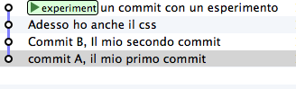

Vedi? Il `remote` non è diventato una copia del tuo `repository`: contiene solo il `branch` che gli hai spedito.

Puoi verificare che i 4 `commit` siano davvero tutti e soli i `commit` che avevi in locale sul ramo `experiment`. 

Anche sul tuo `repository` locale è successo qualcosa. Prova a visualizzarlo

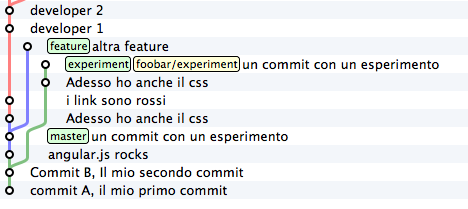

Guarda guarda! Sembra sia stato aggiunto un nuovo `branch`, chiamato `foobar/experiment`. E sembra anche si tratti di un `branch` un po' particolare, perché l'interfaccia grafica si preoccupa di disegnarlo di colore differente.

Prova a cancellare quel `branch`

>**git branch -d foobar/experiment** 
> 
>error: branch 'foobar/experiment' not found. 

Non può essere cancellato. git dice che quel `branch` non esiste. Uhm. Decisamente quell'etichetta ha qualcosa di particolare.

Il fatto è che quel `branch` non è sul tuo `repository`: è su `foobar`. git ha aggiunto un `remote branch` per permetterti di tenere traccia del fatto che, su  `foobar` il `branch` `experiment` punta proprio a quel `commit`.

I `remote branch` sono una sorta di reminder che ti permettono di capire dove si trovino i `branch` sui `repository` remoti ai quali sei collegato.

Così come non puoi cancellare quel `branch` non puoi nemmeno spostarlo direttamente. L'unico modo per spostarlo è che lo sposti `foobar`: indirettamente, quel che puoi fare è inviare con `push` un aggiornamento del ramo `experiment` a `foobar`; la richiesta di `push` è sempre accompagnata dalla richiesta di aggiornamento della posizione del proprio `branch`.

C'è un aspetto molto importante sulla posizione dei `remote branch` a cui dovrai fare l'abitudine: proprio mentre stavi leggendo queste righe un tuo collega potrebbe aver aggiunto qualche `commit` proprio sul suo ramo `experiment` sul `repository` remoto, e tu non ne sapresti niente, perché il tuo `repository` non è collegato in tempo reale con i suoi `remote`, ma si sincronizza solo quando ci interagisci con gli appositi comandi. Per cui, il `commit` puntato da `foobar/experiment` è da intendersi come l'ultma posizione nota del ramo `experiment` su `foobar`.

## Ricevere aggiornamenti con `fetch`

Guarda: proviamo proprio a simulare il caso in cui un tuo collega stia lavorando sull'altro `repository`. Prova ad aggiungere un `commit` sul `repository remoto` proprio sul ramo `experiment` di cui hai appena fatto `push`

>**cd ../repo-remoto** 
>**touch x** 
>**git add x** 
>**git commit -m "un contributo dal tuo collega"** 

Ecco il risultato finale su `foobar`

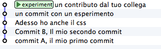

Torna pure al tuo `repository` locale e vediamo cos'è cambiato

>**cd ../progetto** 

Infatti. Non è cambiato niente di niente. 
Il tuo `repository` locale continua a dirti che il ramo `experiment` su `foobar` si trova a "*un commit con un esperimento*". E tu sai benissimo che non è vero! `foobar` è andato avanti, e il tuo `repository` non lo sa. 

Tutto questo è coerente con quel che ti ho detto prima: il tuo `repository` non è collegato in tempo reale con i suo `remote`; ci si allinea solo a comando.

Chiedi allora al tuo `repository` di allinearsi con `foobar`. Puoi chiedere un aggiornamento su un singolo ramo o un aggiornamento su tutti i rami. Di solito, si sceglie la seconda strada

>**git fetch foobar** 
> 
>remote: Counting objects: 3, done. 
>remote: Compressing objects: 100% (2/2), done. 
>remote: Total 2 (delta 1), reused 0 (delta 0) 
>Unpacking objects: 100% (2/2), done. 
>From ../repo-remoto 
>&nbsp;&nbsp;&nbsp;&nbsp;e5bb7c4..c8528bb  experiment -> foobar/experiment 

Qualcosa è arrivato.

Guarda di nuovo il `repository` locale. (Per renderci la vita più semplice, iniziamo a sfruttare un'opzione ci cui la quasi totalità delle interfacce grafiche di git è provvista: la possibilità di visualizzare un singolo ramo e nascondere tutti gli altri, così da semplificare il risultato finale)

Guarda attentamente quello che è successo: il tuo ramo `experiment` non si è spostato di una virgola. Se controlli, anche il tuo `file system` non è cambiato di un solo bit. Solo il tuo `repository` locale è stato aggiornato: git ci ha aggiunto un nuovo `commit`, lo stesso aggiunto remotamente; in concomitanza, git ha anche aggiornato la posizione di `foobar/experiment`, per comunicarti che "*dalle ultime informazioni di cui si dispone, l'ultima posizione registrata su `foobar` del ramo `experiment` è questa*".

Questo è il modo in cui, normalmente, git ti permette di sapere che qualcuno ha proseguito il proprio lavoro su un `repository` remoto.

Un'altra osservazione importante: `fetch` non è l'equivalente di `svn update`; solo il tuo `repository` locale si è sincronizzato con quello remoto; il tuo `file system` non è cambiato! Questo significa che, in generale, l'operazione di `fetch` è molto sicura: anche dovessi sincronizzarti con un `repository` di dubbia qualità, puoi dormire sonni tranquilli, perché l'operazione non eseguirà mai il `merge` sul tuo codice senza il tuo esplicito intervento.

Se invece tu volessi davvero includere i cambiamenti introdotti remotamente nel *tuo* lavoro, potresti usare il comando `merge`. 

>**git merge foobar/experiment**

Riconosci il tipo di `merge` che ne è risultato? Sì, un `fast-forward`. Interpretalo così: il tuo `merge` è stato un `fast-forward` perché mentre il tuo collega lavorava il ramo non è stato modificato da nessun altro; il tuo collega è stato il solo ad avervi aggiunto contributi e lo sviluppo è stato lineare.

Questo è un caso così comune che spesso vorrai evitare di fare `git fetch` seguito da `git merge`: git offre il comando `git pull` che esegue le due operazioni insieme.

Insomma, invece di 

>**git fetch foobar** 
>**git merge foobar/experiment**

avresti potuto lanciare

>**git pull foobar experiment**

Possiamo estendere il diagramma delle interazioni tra i comandi di git e i suoi ambienti aggiungendo la colonna `remote` e l'azione di `push`, `fetch` e `pull`   

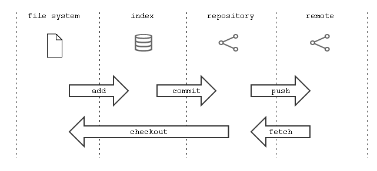

## Sviuppo non lineare

Proviamo a complicare la situazione. 
Vorrei mostrarti un caso che ti capiterà continuamente: quello in cui due sviluppatori stiano lavorando contemporaneamente su un ramo, su due `repository` separati. Di solito accade che, proprio nel momento in cui vorrai spedire al `remote` i tuoi nuovi `commit`, vieni a scoprire che, nel frattempo, qualcuno sul `repository` remoto ha modificato il `branch`. 

Inizia a simulare l'avanzamento dei lavori del tuo collega, aggiungendo un `commit` sul suo `repository`

>cd ../repo-remoto 
>touch avanzamento && git add avanzamento 
>git commit -m "un nuovo commit del tuo collega" 

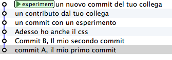

(En passant, nota una cosa: sul `repository` remoto non c'è alcuna indicazione del tuo `repository`; git è un sistema peer-to-peer asimmetrico)

Torna al tuo `repository`

Come prima: fintanto che non chiedi esplicitamente un allineamento con `fetch` il tuo `repository` non sa nulla del nuovo `commit`.

Questa, per inciso, è una delle caratteristiche notevoli di git: essere compatibile con la natura fortemente non lineare delle attività di sviluppo. 
Pensaci: quando due sviluppatori lavorano su un solo branch, SVN richiede che ogni `commit` sia preceduto da un `update`; cioè, che per poter registrare una modifica lo sviluppatore debba integrare preventivamente il lavoro dell'altro sviluppatore. Non puoi eseguire un `commit` se prima non integri i `commit` del tuo collega. 
git, da questo punto di vista, è meno esigente: gli sviluppatori possono divergere localmente, perfino lavorando sullo stesso `branch`; la decisione se e come integrare il loro lavoro può essere intenzionalmente e indefinitamente spostata avanti nel tempo.

In ogni modo: abbraccia la natura fortemente non lineare di git e, deliberatamente ignorando che potrebbero esserci stati avanzamenti sul `repository` remoto, procedi senza indugio con i tuoi nuovi `commit` in locale

>**cd ../progetto** 
>**touch mio-contributo && git add mio-contributo** 
>**git commit -m "un mio nuovo commit"** 

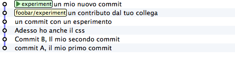

Rifacciamo un punto della situazione su quel che ti ho appena descritto:

* il tuo `repository` non sa del nuovo `commit` registrato su `foobar` e continua a vedere una situazione non aggiornata
* a partire dal medesimo `commit` "*un contributo dal tuo collega*" tu e l'altro sviluppatore avete registrato due `commit` completamente indipendenti.

Aver lavorato concorrentemente sullo stesso ramo, con due `commit` potenzialmente incompatibili, se ci pensi, è un po' come lavorare concorrentemente sullo stesso file, con modifiche potenzialmente incompatibili: quando si metteranno insieme i due risultati, c'è da aspettarsi che venga segnalato un conflitto.

E infatti è proprio così. Il conflitto nasce nel momento in cui si cercherà di sincronizzare i due `repository`. Per esempio: prova a spedire il tuo ramo su `foobar`

>**git push foobar experiment** 
> 
>To ../repo-remoto 
> ! [rejected]        experiment -> experiment (fetch first) 
> error: failed to push some refs to '../repo-remoto' 
>hint: Updates were rejected because the remote contains work that you do 
>hint: not have locally. This is usually caused by another repository pushing 
>hint: to the same ref. You may want to first integrate the remote changes 
>hint: (e.g., 'git pull ...') before pushing again. 
>hint: See the 'Note about fast-forwards' in 'git push --help' for details. 

Rejected. Failed. Error. 
Più che evidente che l'operazione non sia andata a buon fine. 
Ed era prevedibile. Con `git push foobar experiment` avevi chiesto a `foobar` di portare a termine due operazioni:

* salvare nei proprio database tutti i `commit` di cui tu disponi e che remotamente ancora non sono presenti
* spostare la propria etichetta `experiment` in modo che puntasse allo stesso `commit` puntato in locale

Ora: per la prima operazione non ci sarebbe stato alcun problema. Ma per la seconda operazione git pone un vincolo aggiuntivo: il `repository` remoto sposterà la propria etichetta solo a patto che l'operazione si possa concludere con un `fast-forward`, cioè, solo a patto che non ci siano da effettuare dei `merge`. Oppure, detta con altre parole: un `remote` accetta `branch` solo se l'operazione non creerà linee di sviluppo divergenti. 

Il `fast-forward` è citato proprio nell'ultima riga del messaggio di errore

>hint: **See the 'Note about fast-forwards'** in 'git push --help' for details.<br/

Nello stesso messaggio git fornisce un suggerimento: ti dice di provare a fare `fetch`. 
Proviamo

>**git fetch foobar**

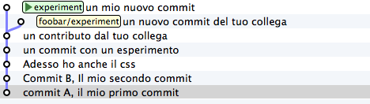

La situazione dovrebbe essere chiara già a colpo d'occhio. 
Si vede che le due linee di sviluppo stanno divergendo. 
La posizione dei due rami aiuta a capire dove ti trovi in locale e dove si trovi il tuo collega sul `remote` `foobar`.

Resta solo da decidere cosa fare. 
A differenza di SVN, che di fronte a questa situazione avrebbe richiesto necessariamente un merge in locale, git ti lascia 3 possibilità

* **andare avanti ignorando il collega**: puoi ignorare il lavoro del tuo collega e proseguire lungo la tua linea di sviluppo; certo, non potrai spedire il tuo ramo su `foobar`, perché è incompatibile col lavoro del tuo collega (anche se puoi spedire il tuo lavoro assegnando alla tua linea di sviluppo un altro nome creando un nuovo `branch` e facendo il `push` di quello); comunque, il concetto è che non sei costretto ad integrare il lavoro del tuo collega;
* **`merge`**: puoi fondere il tuo lavoro con quello del tuo collega con un `merge`
* **`rebase`**puoi riallinearti al lavoro del tuo collega con un `rebase`

Prova la terza di queste possibilità. 
Anzi, per insistere sulla natura non lineare di git, prova a far precedere alla terza strada la prima. In altre parole, prova a vedere cosa succede se, temporaneamente, ignori il disallineamento col lavoro del tuo collega e continui a sviluppare sulla tua linea. 
È un caso molto comune: sai di dover riallinearti, prima o poi, col lavoro degli altri, ma vuoi prima completare il tuo lavoro. git non ti detta i tempi e non ti obbliga ad anticipare le cose che non vuoi fare subito

>**echo modifica >> mio-contributo** 
>**git commit -am "avanzo lo stesso"**

Benissimo. Sei andato avanti col tuo lavoro, disallineandoti ancora di più col lavoro del tuo collega. 
Supponiamo tu decida sia arrivato il momento di allinearsi, per poi spedire il tuo lavoro a `foobar`.

Potresti fare un `git merge foobar/experiment` ed ottenere questa situazione

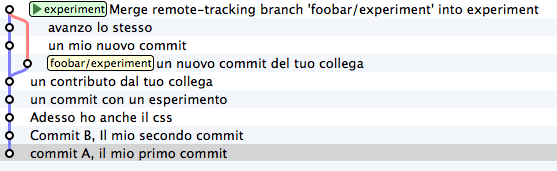

Vedi? Adesso `foobar/experiment` potrebbe essere spinto in avanti (con un `fast-forward`) fino a `experiment`. Per cui, a seguire, potresti fare `git push foobar`.

Ma invece di fare un `merge`, fai qualcosa di più raffinato: usa `rebase`. 
Guarda nuovamente la situazione attuale

Rispetto ai lavori su `foobar` è come se tu avessi staccato un ramo di sviluppo ma, disgraziatamente, mentre tu facevi le tue modifiche, `foobar` non ti ha aspettato ed è stato modificato.

Bene: se ricordi, `rebase` ti permette di applicare tutte le tue modifiche ad un altro `commit`; potresti applicare il tuo ramo a `foobar/experiment`. È un po' come se potessi staccare di netto il tuo ramo `experiment` per riattaccarlo su un'altra base (`foobar/experiment`)

Prova

>**git rebase foobar/experiment**

Visto? A tutti gli effetti appare come se tu avessi iniziato il tuo lavoro *dopo* la fine dei lavori su `foobar`. 
In altre parole: `rebase` ha apparentemente reso lineare il processo di sviluppo, che era intrinsecamente non lineare, senza costringerti ad allinearti con il lavoro del tuo collega esattamente nei momenti in cui aggiungeva `commit` al proprio `repository`.

Puoi spedire il tuo lavoro a `foobar`: apparirà come tu abbia apportato le tue modifiche a partire dall'ultimo `commit` eseguito su `foobar`.

>**git push foobar experiment** 
> 
>Counting objects: 6, done. 
>Delta compression using up to 4 threads. 
>Compressing objects: 100% (4/4), done. 
>Writing objects: 100% (5/5), 510 bytes | 0 bytes/s, done. 
>Total 5 (delta 2), reused 0 (delta 0) 
>remote: error: refusing to update checked out branch: refs/heads/experiment 
>remote: error: By default, updating the current branch in a non-bare repository 
>remote: error: is denied, because it will make the index and work tree >inconsistent  
>remote: error: with what you pushed, and will require 'git reset --hard' to match 
>remote: error: the work tree to HEAD. 
>remote: error: 
>remote: error: You can set 'receive.denyCurrentBranch' configuration variable to 
>remote: error: 'ignore' or 'warn' in the remote repository to allow pushing into 
>remote: error: its current branch; however, this is not recommended unless you 
>remote: error: arranged to update its work tree to match what you pushed in some 
>remote: error: other way. 
>remote: error: 
>remote: error: To squelch this message and still keep the default behaviour, set 
>remote: error: 'receive.denyCurrentBranch' configuration variable to 'refuse'. 
>To ../repo-remoto 
> ! [remote rejected] experiment -> experiment (branch is currently checked out) 
>error: failed to push some refs to '../repo-remoto' 

Mamma mia! Sembra proprio che a git questo `push` non sia piaciuto. Nel lunghissimo messaggio di errore git ti sta dicendo di non poter fare `push` di un `branch` attualmente "*checked out*": il problema non sembra essere nel `push` in sé, ma nel fatto che sull'altro `repository` il tuo collega abbia fatto `checkout experiment`. 

Questo problema potrebbe capitarti di continuo, se non sai come affrontarlo, per cui a breve gli dedicheremo un po' di tempo. 
Per adesso, rimedia chiedendo gentilmente al tuo collega di spostarsi su un altro ramo e ripeti il `push`.

Quindi: su `foobar` vedi di spostarti su un altro `branch`

>**cd ../repo-remoto** 
>**git checkout -b parcheggio** 

Dopo di che, torna al tuo `repository` locale e ripeti `push`

>**cd ../progetto** 
>**git push foobar experiment** 

Ecco il risultato

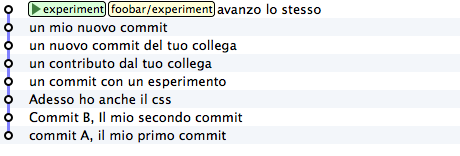

Ripercorriamo graficamente quello che è successo. Partivi da

Poi hai fatto `rebase` ed hai ottenuto

Poi hai fatt `push` su `foobar`: la nuova posizione del `remote branch` `foobar/experiment` testimonia l'avanzamento del ramo anche sul `repository` remoto.

Contestualmente, il tuo collega su `foobar` ha visto passare il proprio `repository` da 

a

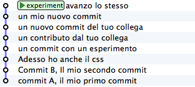

Ti torna tutto? 
Ecco, guarda attentamente le ultime due immagini, perché è proprio per evitare quello che vedi che git si è lamentato tanto, quando hai fatto `git push foobar experiment`. 

Per capirlo, mettiti nei panni del tuo collega virtuale, che abbiamo immaginato sul `repository` remoto `foobar`. 
Il tuo collega se ne sta tranquillo sul suo ramo `experiment` 

quando ad un tratto, senza che abbia dato alcun comando a git, il suo `repository` accetta la tua richiesta di `push`, salva nel database locale un paio di nuovi `commit` e sposta il ramo `experiment` (sì, proprio il ramo di cui aveva fatto il `checkout`!) due `commit` in avanti

Ammetterai che se questo fosse il comportamento standard di git non vorresti mai trovarti nella posizione del tuo collega virtuale: la perdita di controllo del proprio `repository` e del proprio `file system` sarebbe davvero un prezzo troppo alto da pagare.

Capisci bene che cambiare il ramo del quale si è fatto `checkout` significa, sostanzialmente, vedersi cambiare sotto i piedi il `file system`. Ovviamente questo è del tutto inaccettabile, ed è per questo che git si è rifiutato di procedere ed ha replicato con un chilometrico messaggio di errore.

Prima hai rimediato alla situazione spostando il tuo collega virtuale su un ramo `parcheggio`, unicamente per poter spedirgli il tuo ramo. 

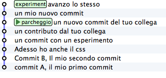

Questo sporco trucco ti ha permesso di fare `push` di `experiment`.

Ma a pensarci bene anche questa è una soluzione che, probabilmente, tu personalmente non accetteresti mai: a parte la scomodità di doversi interrompere solo perché un collega vuole spedirti del suo codice, comunque non vorresti che l'avanzamento dei tuoi rami fosse completamente fuori dal tuo controllo, alla mercé di chiunque. Perché, alla fine, il remo `experiment` si sposterebbe in avanti contro la tua volontà, e lo stesso potrebbe accadere a tutti gli altri rami di cui non hai fatto `checkout`.

È evidente che debba esistere una soluzione radicale a questo problema.

La soluzione è sorprentemente semplice: **non permettere ad altri di accedere al tuo `repository`**. 

Potresti trovarla una soluzione un po' sommaria, ma devi riconoscere che non esista sistema più drastico ed efficace. E, fortunatamente, è molto meno limitante di quanto tu possa credere ad una prima analisi.

Naturalmente, ti ho raccontato solo metà della storia e forse vale la pena di approfondire  un po' l'argomento. 
Apri bene la mente, perché adesso entrerai nel vivo di un argomento molto affascinante: la natura distribuita di git. Si tratta, verosimilmente, dell'aspetto più comunemente incompreso di git e, quasi certamente di una delle sue caratteristiche più potenti.

# Obiettivo 7: disegna il tuo workflow ideale

Se hai usato CVS e SVN sarai senz'altro abituato al concetto di `repository` centrale: tutti gli sviluppatori attingono e fanno riferimento ad un'unica struttura centrale, dove è conservato il codice sorgente.

Nell'esempio che abbiamo utilizzato fino ad ora il team era composto da 2 sviluppatori: tu ed il tuo collega. Ti sarai accorto che già con un team di  dimensione così ridotta l'organizzazione dei repository, con git, ha qualcosa di particolare: prima di tutto perché ci sono due `repository`; e poi perché, dei due `repository`, non si capisce bene quale sia quello *ufficiale*.

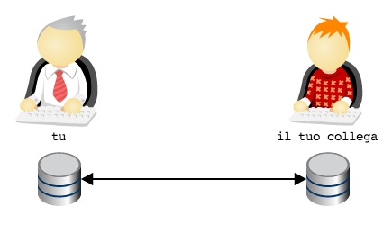

A complicare le cose c'è il fatto che, a quanto pare, non si dovrebbe permettere ad altri di accedere al proprio `repository`. Decisamente la faccenda si fa confusa e nebulosa.

Cerchiamo di mettere chiarezza. 
Partiamo da un assunto: git è abbastanza versatile da replicare totalmente l'organizzazione a `repository` centrale di SVN. Per cui, se proprio per te fosse uno shock culturale insostenibile anche solo pensare di organizzare il tuo workflow in altro modo, riproduci la struttura di SVN e vivi felice ed ignorante. 
Ti uniresti ad un lungo elenco di aziende e di team che, di fronte alle possibilità offerte da git, rimediano rifugiandosi nell'arcinota architettura a `repository` centrale, così che tutto cambi perché tutto resti come prima. Tutti sereni e tutti contenti. 
È una opzione. Non è delle più felici, perché impedisce di godere di alcuni dei grandi vantaggi dell'usare un sistema di versionamento distribuito, ma è sempre un'opzione percorribile Un mio collega la descrive come "*avere finalmente il fucile ed usarlo come una clava*". 
Diciamo pure che non è l'opzione che verrà promossa da questa guida.

In questo capitoletto proveremo piuttosto ad esplorare altre implementazioni meno banali.

Partiamo da un'euristica che io ho sempre trovo molto efficace:

>utilizza una topologia di `repository` che rispecchi il reale flusso di lavoro e i reali ruoli funzionali esistenti nel team

Tradotto in soldoni e applicato al nostro caso concreto: tu e il tuo collega state usando git principalmente per 3 funzioni

* tu, per sviluppare il codice
* il tuo collega, per sviluppare il codice
* entrambi, per scambiarvi il codice ed integrare il lavoro di entrambi

L'idea è: per ogni funzione, usa un `repository` dedicato. 
In altre parole, potreste prendere in considerazione l'ipotesi di aggiungere un `repository`, raggiungibile sia da te che dal tuo collega, da utilizzare come area di integrazione

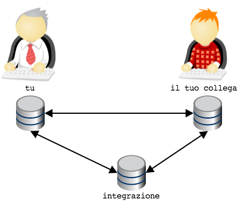

Ora: verrebbe già più spontaneo eleggere il `repository` `integrazione` come il `repository` ufficiale, non trovi?

A rigore, non c'è fisicamente niente che caratterizzi il repository `integrazione` come`repository` centrale: tecnicamente è del tutto equivalente agli altri due. 
L'idea di fondo che è che il ruolo e l'importanza di un `repository` rispetto ad un altro sia una questione sociale e organizzativa, non imposta da vincoli o limiti tecnologici: git si limita a permettere di modellarla, ma non impone la minima opinione in materia.

Quindi, supponiamo che, per convenzione o per accordo tra le parti si decida che il repository `integrazione` venga usato per permettere l'integrazione tra il lavoro tuo e quello del tuo collega e come archivio *ufficiale*; gli altri due `repository` saranno da intendersi come archivi ad uso esclusivo di ogni sviluppatore.

Puoi rinforzare questa struttura utilizzando un paio di strumenti che git ti mette a disposizione.

Per prima cosa, potresti creare il repository `integrazione` con il comando `git init --bare`; l'opzione `--bare` fa in modo che il `repository` non possa essere utilizzato come base di lavoro: verrà creato solo il database, senza il `file system`, per cui non sarà possibile fare `add` e `checkout`

Invece, sui due `repository` personali, potresti configurare ad arte i permessi di accesso, restringendoliai soli proprietari; tu sarai il solo a poter leggere e scrivere sul tuo `repository` personale, e non avrai modo di accedere a quello del tuo collega; e vice versa. Vi perdete la possibilità di spedirvi `branch` senza passare dal `repository` centrale, ma a breve vedremo delle configurazioni più articolate.

Ecco qui: hai una topologia molto simile alla soluzione centralizzata di SVN, con la sola differenza che ogni sviluppatore dispone di un `repository` privato locale.

Possiamo fare di più? 
Certo che sì. Se ne vale la pena. Nello specifico: se l'intero team di sviluppo è costituito da te e dal tuo collega, questa soluzione potrebbe già essere perfetta.

Ma le cose potrebbero essere molto differenti: considera per esempio il caso in cui il tuo collega sia un consulente esterno, al quale non vuoi dare direttamente la possibilità di modificare direttamente il codice nel `repository` ufficiale se non dopo una tua revisione ed accettazione del codice.

Una possibilità potrebbe essere quella di decidere che sia il *tuo* `repository` quello ufficial, così da organizzare i tool di Continuous Integration e di Deployment perché prelevino il codice da lì. 
Oppure, potresti ripensare all'euristica

>utilizza una topologia di `repository` che rispecchi il reale flusso di lavoro e i reali ruoli funzionali esistenti nel team

e decidere di aggiungere un nuovo `repositorty` con il ruolo di *archivio ufficiale* del codice pronto ad andare in produzione e restringere l'accesso in scrittura solo a te

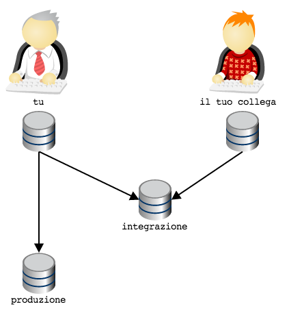
 

Inizi ad intuire che questa storia dei `repository` offra una gamma pressocché illimitata di possibilità?

Guarda: voglio mostrarti una configurazione topologica che è molto diffusa e che sicuramente incontrerai, specialmente dovessi partecipare a qualche progetto *open source* su GitHub.

Considera di nuovo l'ultima illustrazione. Il tuo `repository` e quello del tuo collega sono sicuramente `repository` locali, ospitati sulle rispettive macchine di sviluppo. Generalmente, quindi, non sono `repository` facilmente accessibili dall'esterno. 
Quindi, quando avevo disegnato lo schema

ero stato molto superficiale e frettoloso, perché avevo del tutto sorvolato sul problema, tutt'altro che banale,  di come far comunicare i due `repository`, ospitati probabilmente su due *laptop*, senza IP fisso o dominio: una condivisione di cartelle con Samba? Un server ssh installato su entrambi i *laptop*? Dropbox?

Una delle soluzioni più di successo sembra suggerita da un aforisma di David Wheeler che recita
 
>*All problems in computer science can be solved by another level of indirection*

In git potrebbe valere una legge simile: quando hai un problema di workflow, prova a modellare la tua opologia di `repository` aggiungendo un nuovo livello di indirezione.

Applicato al nostro caso, potremmo pensare di fornire a te e al tuo collega non un singolo `repository` ciascuno, ma una coppia di `repository`: uno ad uso privato, per sostenere le attività di sviluppo, ed uno pubblico, per consentire la reciproca comunicazione

Quindi: ogni sviluppatore dispone del proprio `repository` privato di lavoro, e di un `repository` pubblico. Tutti possono accedere al `repository` pubblico di chiunque, ma solo il legittimo proprietario può scriverci (nel grafico, per semplicità, è inteso che chiunque possa accedere in lettura a qualunque `repository` pubblico).

Ecco: questa è la tipica organizzazione di un'azienda che abbia adottato il workflow di GitHub.

Sono possibili innumerevoli variazioni di questa organizzazione base. 
Per esempio: il team potrebbe prevedere che il codice vada in produzione in pacchetti di funzionalità decise da un `release manager`

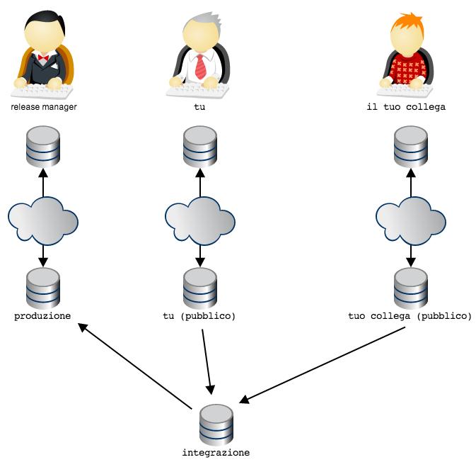

In questa topologia si è deciso che il `repository` dal quale si preleva il codice per il deployment in produzione sia il `repository` pubblico del *release manager*: il *release manager* preleva il codice da `integrazione`. Il flusso di lavoro è garantito dal fatto che il *release manager* sia l'unico a disporre dei diritti di `push` sul proprio `repository` pubblico. 

Facciamo un altro esempio: si potrebbe decidere che il prodotto debba sempre passare da un ambiente di stage (per esempio, un ambiente di produzione solo per utenti abilitati al *beta testing*)

Nota come l'organizzazione, in git, sia ottenuta non limitando le letture (sostanzialmente, in tutti questi schemi tutti hanno diritti di lettura su qualsiasi `repository` pubblico), ma garantendo i permessi di scrittura su `repository` solo ai proprietari designati; sarà poi la convenzione sociale a stabilire a quale uso destinare ogni `repository` (collegando, per esempio, gli script di deployment ad un `repository` piuttosto che ad un altro).

Si potrebbe immaginare la topologia dei `repository` come un sistema di vasche comunicanti; in ogni vasca si può far fluire selettivamente il codice da una o più altre vasche comunicante; ad ogni persona che ricopra un determinato ruolo nel flusso di lavoro viene dato il controllo esclusivo della chiusa che apre o chiude il flusso di codice nella propri vasca.

In linea generale: tutti i tipi di workflow che prima con SVN si era costretti ad implementare usando convenzioni  sui nomi e sugli usi dei branch, in git sono molto facilmente modellabili con topologie di `repository`. È un vero peccato quando un team che abbia adottato git cerchi di riprodurre un controllo del workflow con gli stessi sistemi di SVN, perché farà un grande sforzo per otteere molto meno di quel che git potrebbe fornire.

Ti accorgerai, invece, di come convenga quasi sempre modellare la rete di `repository` in modo che rifletta il workflow e l'organizazione gerarchica del tuo team. 
Per esempio, non è raro che in grande organizzazioni il flusso di lavoro sia abbastanza articolato da richiedere  più team, con una distribuzione gerarchica dei ruoli e delle responsabilità: potrebbe esserci un responsabile del progetto a cui riportano un paio di responsabili di team che, a loro volta, gestiscono più persone. 
Ecco: è comune che in queste occasioni si tenda a modellare la rete di `repository` ad immagine della gerarchia dei ruoli, adottando quello che viene chiamato "*Dictator and Lieutenants Workflow*"

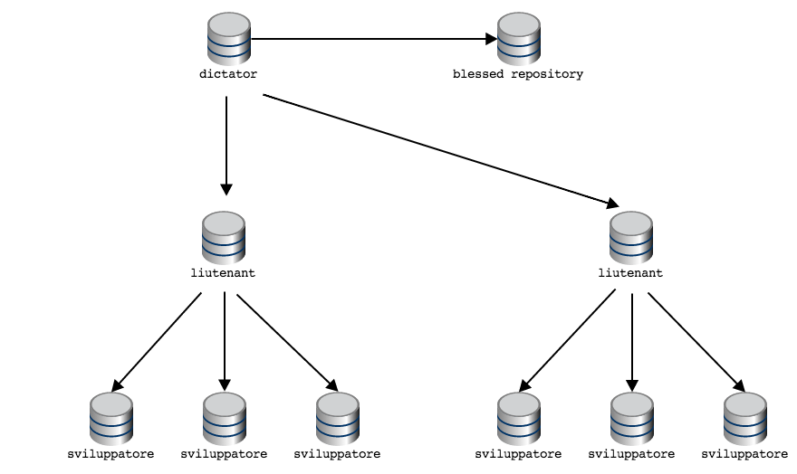

Nota che quando i diagrammi delle topologie sono particolarmente articolati, si rappresentano solo i `repository` pubblici, dando per scontato che ogni persona adibita al controllo di quel `repository` pubblico (cioè, fornita dei diritti di `push`) avrà un `repository` privato sulal propria macchina locale.

Daily git
=========

Questa guida si chiude con una breve serie di piccoli suggerimenti pratici che ti risulteranno molto utili nel tuo uso quotidiano di git

# Ottenere una copia di un `repository`

Fin'ora hai visto come creare un `repository` da zero e come fare a popolarne uno vuoto a colpi di `push`, ma spesso (anzi, spessissimo) fa molto comodo partire da una copia di un `repository` esistente.

Allo scopo, usa il comando `git clone`, col quale otterrai in locale una copia completa della storia dei `commit` di un `repository`. Dopo aver clonato un `repository` remoto,  questo verrà aggiunto in automatico come `remote` sotto il nome di default `origin`.

Per esempio, per ottenere un `clone` di questa guida esegui

>**git clone https://github.com/arialdomartini/get-git.git** 
>cd get-git 
>**git remote** 
>origin

# Eliminare un file

Rammenti che per aggiungere un file nell'`index` hai usato il comando `git add`? 
Ecco: quando cancelli dal `file system` un file già tracciato da git, perché git includa la cancellazione nel `commit` devi cancellare il file anche dall'`index` con

>**git rm file_name**

Potresti trovare molto comoda l'opzione `-a` di `commit` 

>**git -am "include add e rm"**

che implicitamente fa `add` dei file modificati e `rm` di quelli rimossi

# Sovrascrivere l'ultimo `commit`

* detached head state
* amend
* eliminare l'ultimo commit
* revert del filesystem
* diff di due branch
* diff del file system
* pull
* range di commit